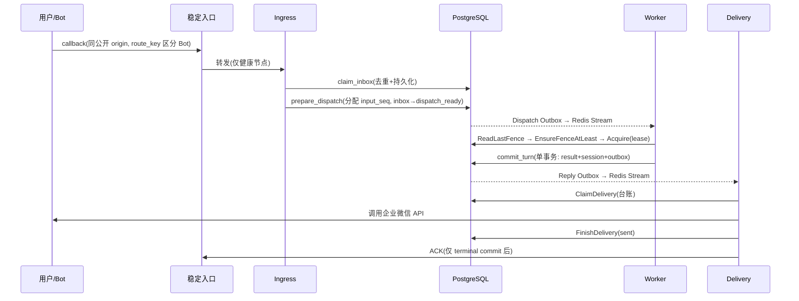
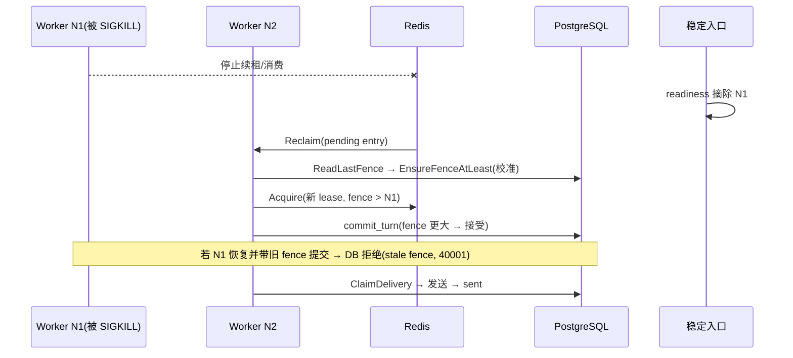

# 故障恢复后继续对话 — 设计文档

**组织方式：** 做什么 → 为什么 → 怎么做 → 目标代码位置（括号内为可选核对路径）。

---

## 一、总体架构

```text
                 ┌────────────────── PostgreSQL（权威源）──────────────────┐
企业微信 Bot A/B ─┤ tenant/binding/route │ inbox/outbox │ session_* │        │
       │         │ result_payload │ delivery_ledger │ webui_message        │
       │         └───────────────────────────▲────────────────────────────┘
       │                                     │ 读/写
       ▼                                     │
  wecom-ha-entry（稳定入口，唯一暴露）         │
       │  /readyz 健康轮转转发                │
       ▼                                     │
  Ingress（route→binding→verify→Tenant）──────┘
       │
       ▼  claim_inbox（去重+持久化）
  Dispatch Outbox ──▶ Redis Work Stream
                          │  Reclaim / Consume
                          ▼
                   Worker N1 / N2（session lease + fence）
                          │  commit_turn（单事务）
                          ▼
                   Reply Outbox ──▶ Redis Reply Stream
                                        │
                                        ▼
                                 Delivery（Ledger CAS）
                                        │
                                        ▼
                                  企业微信回复 API
```

**分层：** PostgreSQL 是 tenant、binding、session、Inbox/Outbox、terminal result 与 Delivery Ledger 的权威源；Redis 只保存可重放 transport、lease 与消费者 pending 状态。节点死亡后仍能继续，是因为权威事实在库里。

---

## 二、四元组持久化链路

```text
tenant_id ─┐
agent_app_id (Bot Binding) ─┤  推出 Tenant Context + Agent + 配置版本 + 凭据
session_id ─┤  原会话稳定标识（外部 chat）
external_message_id ─┘  单条入站消息（inbox 去重键的一部分）
```

| 阶段 | 主键 / 唯一键 | 表 |
|---|---|---|
| 路由 | `route_key_digest` → `opaque_binding_id` | `channel_public_route` |
| 验签 | `candidate_token_digest`, `purpose='channel_verify'` | `channel_ingress_candidate` |
| 入站去重 | PK `(tenant_id, channel, external_account_id, external_message_id)`；UNIQUE `(tenant_id, request_id)` | `inbox` |
| 会话头 | PK `(tenant_id, agent_app_id, session_id)` | `session_head` |
| 会话事件 | PK `(tenant_id, agent_app_id, session_id, session_seq)` | `session_event` |
| 提交 | PK `(tenant_id, agent_app_id, session_id, commit_id)`；终态唯一索引 `(tenant_id, agent_app_id, session_id, input_seq) WHERE outcome∈终态` | `session_commit` |
| 执行记录 | PK `(tenant_id, request_id)` | `execution_record` |
| 投递台账 | PK `(tenant_id, delivery_key, segment_no)` | `delivery_ledger` |
| 出箱 | PK `(tenant_id, outbox_id)`；唯一 `(tenant_id, kind, idempotency_key)` | `outbox` |

会话键在 Go 中为 `coordination.SessionKey{TenantID, AgentAppID, SessionID}`（仓库对应位置，可选核对：`trpcservice/coordination/lease.go`、`trpcservice/storage/session/atomic.go`）。

---

## 三、数据模型（真实字段）

> 字段、约束、`CHECK` 均逐字取自 `migrations/000001_service_schema.up.sql`，完整 DDL 见 `REFERENCE-IMPLEMENTATION.md` §2。

### 3.1 session_head（行 4388）
| 字段 | 类型 | 说明 |
|---|---|---|
| tenant_id, agent_app_id, session_id | text NOT NULL | PK 三元组 |
| version | bigint DEFAULT 0 | 会话版本（乐观锁） |
| last_fence | bigint DEFAULT 0 | 最后有效 fence（拒绝迟到写） |
| last_session_seq | bigint DEFAULT 0 | 已提交事件序号上限 |
| next_input_seq | bigint DEFAULT 1 | 下一个待分配输入序号 |
| last_allocated_input_seq | bigint DEFAULT 0 | 已分配输入序号 |
| state_json | jsonb DEFAULT '{}' | 会话状态增量 |
| summary_id | text | 摘要引用 |
| created_at, updated_at | timestamptz | 时间戳 |

### 3.2 session_commit（行 4338）
`tenant_id, agent_app_id, session_id, commit_id, request_id, request_digest(sha256 hex), input_seq(>=1), stage, outcome, fence(>=1), session_version(>=1), reply_cursor, result_ref, created_at`。
`outcome CHECK IN ('pending','queued','running','waiting_confirmation','succeeded','denied','failed','cancelled','confirmation_denied','confirmation_timeout')`。
终态唯一索引（行 5621）：`(tenant_id, agent_app_id, session_id, input_seq) WHERE outcome IN ('succeeded','denied','failed','cancelled','confirmation_denied','confirmation_timeout')`。

### 3.3 session_event（行 4365）
`tenant_id, agent_app_id, session_id, session_seq(>=1), request_id, input_seq(>=1), event_seq(>=1), event_id, event_type, payload_ref, created_at, event_payload jsonb`。

### 3.4 inbox（行 240）
`tenant_id, channel, external_account_id, external_message_id, request_id, agent_app_id, session_id, input_seq, state, payload_ref, payload_digest(sha256 hex), terminal_reason, result_ref, key_version(>=1), version(>=0), created_at, updated_at, external_chat_id, external_user_id`。
`state CHECK IN ('preprocess_pending','dispatch_pending','dispatch_ready','terminal')`；`payload_digest CHECK ~ '^[0-9a-f]{64}$'`。
PK `(tenant_id, channel, external_account_id, external_message_id)`；UNIQUE `(tenant_id, request_id)`。

### 3.5 execution_record（行 3816）
`tenant_id, request_id(PK), tenant_version, agent_app_id, agent_app_version, agent_app_revision, agent_content_digest, config_version, policy_version, session_id, user_id, channel, input_seq(>=1), payload_ref, traceparent, outcome DEFAULT 'queued', result_ref, park_attempt DEFAULT 0, not_before, version DEFAULT 0, created_at, park_deadline, blocked_at, blocked_reason, cancel_requested_at, cancel_version DEFAULT 0`。
索引（行 5551）：`execution_park_ready_idx (tenant_id, agent_app_id, session_id, input_seq, not_before) WHERE outcome='pending'`。

### 3.6 delivery_ledger（行 3761）
`tenant_id, delivery_key, segment_no(int>=0), provider_message_id, state, version DEFAULT 1, updated_at, renderer_version DEFAULT 'legacy-v1', format_version DEFAULT 'legacy-v1', content_digest DEFAULT 64×'0', segment_count DEFAULT 1, attempt DEFAULT 0, not_before, last_error_class, client_request_id, claim_owner, claim_until, reconcile_attempt DEFAULT 0`。
`state CHECK IN ('pending','sending','sent','ambiguous','retry_wait','failed')`；`CHECK ((state='sending' AND claim_owner NOT NULL AND claim_until NOT NULL) OR (state<>'sending' AND claim_owner IS NULL AND claim_until IS NULL))`；`CHECK segment_count>=1 AND segment_no < segment_count`。
索引（行 5537）`delivery_ledger_claim_expiry_idx (claim_until) WHERE state='sending'`；（行 5544）`delivery_ledger_retry_idx (state, not_before, updated_at) WHERE state IN ('pending','retry_wait','ambiguous')`。

### 3.7 outbox（行 4187）
`tenant_id, outbox_id, kind, aggregate_id, event_seq>=0, idempotency_key, payload_ref, traceparent, state DEFAULT 'pending', version, attempt, next_attempt_at, claim_owner, claim_until, published_at, created_at`。
`kind CHECK IN ('audit','tenant-control','config-invalidation','dispatch','reply','wakeup','execution-control')`；`state CHECK IN ('pending','claimed','retry_wait','published','dead_letter')`；唯一约束 `outbox_tenant_id_kind_idempotency_key_key → (tenant_id, kind, idempotency_key)`。
索引（行 5600）`outbox_claim_idx (kind, state, next_attempt_at, created_at)`。

### 3.8 其余相关表
- `channel_binding`（行 3574）：`tenant_id, config_version, binding_id, channel, external_account_id, agent_app_id, secret_ref, secret_version, created_at, send_secret_ref, send_secret_version`。
- `channel_binding_locator`（行 3595）：`opaque_binding_id, tenant_id, config_version, binding_id, identity_secret_ref/version, session_secret_ref/version`。
- `channel_public_route`（行 3643）：`channel, route_key_digest, opaque_binding_id, binding_version, enabled, created_at, updated_at`（opaque_binding_id 16..256、route_key_digest 16..256）。
- `channel_ingress_candidate`（行 3615）：`candidate_token_digest, opaque_binding_id, channel, route_key_digest, purpose='channel_verify', binding_version, state, receipt_token_digest, protocol_identity_digest, issued_at, expires_at, verified_at, version`。
- `result_payload`（行 4320）、`prepared_payload`（行 4239）、`inbound_payload`（行 3877）、`webui_message`（行 4693，索引 `webui_message_mailbox_idx` 行 5649）。

---

## 四、会话状态机

### 4.1 inbox 状态
```text
preprocess_pending ─▶ dispatch_pending ─▶ dispatch_ready ─▶ terminal
       │                    │
       └────(预处理失败)────┴──▶ rejected (preprocess_job)
```
`preprocess_job.state ∈ ('pending','running','ready','rejected','retry_wait')`；`CHECK ((dispatched_at IS NULL) OR state='ready')`。

### 4.2 execution_record 状态
```text
queued ─▶ running ─▶ pending ──(前序未终态)──▶ [parked → pending] … ─▶ succeeded/denied/failed/cancelled/...
                    │
                    └──(park 超限)──▶ blocked (park_attempts_exhausted / park_deadline_exceeded)
```
`park_execution` 负责 `pending/ready/terminal/blocked` 的停放判定（详见 `REFERENCE-IMPLEMENTATION.md` §3.4）。

### 4.3 delivery_ledger 状态
```text
pending ─▶ sending ──(成功, P4 确认)──▶ sent
   │          │
   │          ├─(response_lost)──▶ ambiguous ─▶ reconcile ─▶ sent / retry_wait / (超限) failed
   │          └─(失败)──▶ retry_wait ─▶ pending
   └─(重试耗尽/永久错误)──▶ failed
```
`sent` 后不可重发；`claim` 仅当 `state='sending'` 且 `claim_owner/claim_until` 非空。

---

## 五、正常消息时序图（mermaid）



---

## 六、故障接管时序图（mermaid）



---

## 七、模块划分

| 模块 | 职责 | 目标代码位置 |
|---|---|---|
| 双 Bot 可信路由 | route→binding→verify→Tenant Context，tenant 不串 | `trpcservice/channels/ingress/`、`trpcservice/channels/wecom/adapter.go` |
| 会话恢复 | 原会话稳定命中，仅恢复本租户已提交上下文 | `trpcservice/storage/session/`、`trpcservice/worker/runner.go` |
| Worker 接管 + fence | 旧 N1 失联后 N2 取更高 fence，旧 N1 迟到写被拒 | `trpcservice/coordination/redis/lease.go`、`trpcservice/worker/consumer.go`、`trpcservice/storage/session/postgres/store.go` |
| 回复可靠投递 | 结果提交后异步发送，台账保证每片段一次 | `trpcservice/channels/delivery/`、`trpcservice/storage/messaging/postgres/store.go` |
| 实例身份与就绪 | owner 含 ProcessStartID，/readyz 覆盖 db+redis+malware | `cmd/trpc-service/webui_local_role.go` |
| 稳定入口 | 只转发健康后端，不替代业务幂等 | `cmd/trpc-service/wecom_ha_entry_role.go` |
| 编排 | bootstrap + 双节点(restart:no) + 入口 | `deploy/compose/docker-compose.local.yml`（profile `wecom-ha-local`） |

**当前实现（仓库已落地）：** `webui-local` 支持 `TRPC_WECOM_SECONDARY_LOCAL_ENABLED=true` 与一组 `WECOM_SECONDARY_*` 凭据。在显式启用且两个 Bot 的 `(Corp ID, Agent ID)` 不同前提下，bootstrap 建立 Tenant B、独立 app/policy、`local-wecom-secondary` binding、独立 ingress route 与 tenant-scoped identity/session/payload/model/channel-secret scope。两 Bot 可共享同一基础设施，却不共享业务身份。次 Bot 同样装配当前的 `webui_create_note`（`idempotent_key`）恢复契约；是否启用工具由各自 policy/config 决定，而不是借用主 Bot 状态。

---

## 八、为什么这些设计点缺一不可（摘要）

- **不能只做 Redis 锁**：网络隔离后旧执行者迟到写需 fence 兜底（§5）。
- **不能 ACK 后写库**：ACK 必须在 terminal commit 之后，否则崩溃丢消息（I5）。
- **不能靠容器重启**：`restart:"no"` + 新 ProcessStartID 才证明“另一节点接管”而非“自愈”（I9）。
- **不能跳过 P3/P4 对账**：下游不确定时必须诚实 `ambiguous`，否则会双发或谎报成功（I6/I7）。
- **不能把健康当成可服务**：`/readyz` 必须覆盖 db+redis+malware，否则"活着但读不了会话"的节点会吞 callback（I10）。

---

## 九、数据库拒绝语义总表（实现时必须按此映射）

系统的正确性大量依赖"数据库主动拒绝"，因此必须把 SQLSTATE 正确映射为应用层错误，并按语义决定重试还是上抛：

| SQLSTATE | 触发点 | 语义 | 映射错误 | 上层应如何处理 |
|---|---|---|---|---|
| `40001`（消息含 `stale fence`） | `commit_turn` 的 `p_fence < last_fence` | 旧 owner 迟到写 | `ErrStaleFence` | **上抛**，不重试（重试只会再被拒） |
| `40001`（其他） | `expected_version <> head.version` / `prepare_dispatch` 的租户或 config 版本冲突 | 乐观锁竞争 / 配置漂移 | `ErrVersionConflict` | **可重试竞争**（`Consumer.process` 按 `RetryWait` 重试） |
| `23505` | `claim_inbox` 幂等冲突 / `commit_turn` 的 commit id 冲突 / `prepare_dispatch` 幂等冲突 | 业务幂等键冲突 | `ErrCommitConflict` | **可重试竞争** |
| `XX001` | 终态不变量缺失（应存在终态 `session_commit` 却找不到） | 数据不一致 | `ErrInvariantViolation` | 🔴 上抛并告警，禁止当竞争重试 |
| `55000` | `input_seq > next_input_seq`（`prepare_dispatch` 中 tenant disabled 也走类似分支） | 前序未就绪 | `ErrInputNotReady` | 走 park 逻辑（`park_execution`） |
| `P0902` | 取消被请求 | 执行取消 | `ErrCancelRequested` | 走 `CancelWithLease` |
| `42501` | 作用域/租户不匹配（`execution scope mismatch` / `inbox scope or state mismatch`） | 越权或链路错配 | `ErrTenantScope` | 🔴 上抛并告警（这是安全信号） |
| `P0002` | 实体不存在 | 未找到 | `ErrNotFound` | 视调用点决定重试或上抛 |
| `no rows` | `SELECT ... Scan` 无结果 | 未找到 | `ErrNotFound` | 同上 |

**为什么必须区分 `ErrVersionConflict` 与 `ErrInvariantViolation`：** 前者是正常的并发竞争，重试即可收敛；后者说明数据已处于不一致状态，无限重试会持续消耗资源并掩盖问题。把两者混为一类，是这类系统最常见的隐性缺陷。

---

## 十、并发与竞态分析

| 竞态 | 可能后果 | 消除机制 |
|---|---|---|
| 两个 Worker 同时执行同一会话 | 两条输入交错写入，历史错乱 | Redis lease（同一时刻只有一个持有者）+ `commit_turn` 的 `expected_version` |
| 网络隔离后旧 owner 迟到写 | 新结果被旧结果覆盖 | `commit_turn` 的 `p_fence < last_fence` 拒绝 |
| 平台重传同一 provider 消息 | 同一输入被处理两次 | `inbox` 四元组唯一键 + `claim_inbox` 的 `ON CONFLICT DO NOTHING` + 冲突拒绝 |
| `prepare_dispatch` 被重复调用 | 重复分配 `input_seq`，任务翻倍 | `dispatch_ready` 分支的八元组反查 + 同事务分配 |
| 两个 relay 同时发布同一 outbox 行 | 下游收到重复事件 | outbox 唯一约束 `(tenant_id, kind, idempotency_key)` + `ON CONFLICT ... DO NOTHING` |
| 两个 Delivery 同时发送同一 segment | 用户看到重复回复 | `Delivery Ledger` 的 claim 条件更新（`state='sending'` 才可领）+ version/owner/client_request_id 四重条件 |
| 发送者崩溃后 claim 未释放 | 该 segment 永久卡在 `sending` | `claim_until` 到期后 `ClaimDelivery` 先把它改写为 `ambiguous/owner_lost` |
| Redis fence 计数回退 | 新 lease 拿到小于数据库的值 → 合法接管者被拒 | Worker 先 `ReadLastFence` → `EnsureFenceAtLeast` 校准 |
| 续租失败但执行仍在继续 | 已失权节点继续调用外部写工具 | `markLeaseLost()` 取消执行 context；`beforeCommit` 二次续租检查 |
| 取消请求与正常提交竞争 | 已取消的执行仍提交成功 | 取消也走 `beforeCommit` 续租检查与 fence 提交 |

**原则：** 每一个"只能成功一次"的动作，都必须有一个**数据库层的条件更新或唯一约束**兜底，不能只依赖应用层的判断或 Redis 锁。

---

## 十一、资源隔离与容量设计

### 11.1 必须隔离（每实例独立）

| 资源 | 隔离方式 | 复用会怎样 |
|---|---|---|
| 节点身份 | `TRPC_WEBUI_LOCAL_INSTANCE_ID` | owner 名重合，接管不可归因 |
| 进程身份 | 每次启动随机 `ProcessStartID` | 重新加入被误认为旧 owner 复活 |
| 观测端口 | 宿主 58088 / 58089 | 端口冲突或误登记为回调地址 |
| 容器文件系统本地暂态 | Docker 各自容器层 | 并发写损坏 |
| 重启计数 | 独立容器 | "受害节点持续停止"无法证明 |

### 11.2 必须共享（同故障域，权威或有状态协调）

| 资源 | 作用 | 单实例容量要求 |
|---|---|---|
| PostgreSQL | binding / inbox / session / execution / outbox / result / ledger | 任一实例宕机时，存活实例需独自承接全量写 |
| Redis | Work/Reply/Wakeup Stream、lease、fence | 覆盖 pending 峰值 + 每会话 1 lease key + 1 fence key |
| 恶意内容探针（malware） | `/readyz` 依赖 | 不可用会导致全部节点 unready |
| Qdrant / ClamAV / otel | 知识检索 / 媒体扫描 / 遥测 | 视部署形态，同属共享依赖 |

### 11.3 容量结论的纪律

- 单实例容量应不低于**峰值全量**（而非峰值 / 2），因为接管后由它独自承担。
- P2 接管会**重跑模型**，接管窗口内模型调用量高于稳态，需单独预留。
- 续租是高频小事务，PostgreSQL 连接池耗尽会先表现为 `ErrLeaseLost` 激增（而非明显的连接错误）。
- 低流量演练只证明**可用性**，不可外推为**容量承诺**。

---

## 十二、文档索引

| 想了解 | 读 |
|---|---|
| 完整原理与因果链、脑裂分析、判据 | `FULL-GUIDE.md` |
| 逐模块实现与 durable truth | `implementation-walkthrough.md` |
| 关键代码摘录 | `CODE-APPENDIX.md` |
| 从零复现（DDL / Lua / 接口 / 算法 / 配置） | `REFERENCE-IMPLEMENTATION.md` |
| 测试与验收 | `testing-and-acceptance.md` |
| 发布、观测、告警、回滚、处置 | `release-and-operations.md` |
