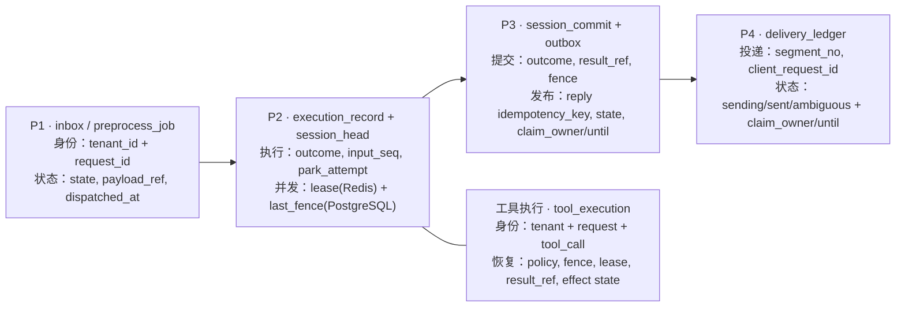

# 在途任务接管与幂等投递 — 自足复现参考实现

> **本文是复现本能力的权威材料。** 一个从未见过本仓库源码的工程师，凭本文即可从零实现等价系统并通过同等验收。
> **事实来源约束：** 本文所有表名、字段名、SQL 函数名、环境变量名、Go 标识符、错误码，均与参考实现逐字一致。本文是这些事实的「抄录 + 组织」，不虚构、不改名、不臆造不存在的 API。

---

## 0. 事实来源说明

| 类别 | 来源（真实路径，仅作索引） |
|---|---|
| 表 / 索引 / 函数 DDL | `migrations/000001_service_schema.up.sql` |
| barrier 接口与 Controller | `trpcservice/reliability/inflight/barrier.go` |
| P1 挂点 | `trpcservice/preprocess/worker.go` |
| P2 挂点 / 提交 | `trpcservice/worker/runner.go` |
| 消费 / 续租 / ACK | `trpcservice/worker/consumer.go` |
| P3 挂点 / reply publish | `trpcservice/relay/reply.go` |
| P4 挂点 / reconcile | `trpcservice/channels/delivery/service.go` |
| Ledger CAS SQL | `trpcservice/storage/messaging/postgres/store.go` |
| 会话原子契约 | `trpcservice/storage/session/atomic.go` |
| 租约 Redis Lua | `trpcservice/coordination/redis/lease.go` |
| 演练脚本 | `scripts/e2e/inflight-takeover.sh` |

以上路径**仅作可选核对**，不是实现说明的依赖。本文已把必要内容抄录完整。

---

## 0.5 先看数据：四个故障窗口各留下什么

将下图当作“恢复地图”阅读：每一站先 durable，再允许下一站工作；新节点只从最后一个已落库的方块继续。字段名按职责分组，下一章才给逐字 DDL。



| 故障瞬间 | 先读的记录 | 接管动作 | 绝不做的事 |
|---|---|---|---|
| P1 | `inbox`、`preprocess_job` | 重新领取并 dispatch 同一输入 | 让用户重发或另建 request。 |
| P2 | Redis lease/fence、`execution_record`、`tool_execution` | reclaim，取得更高 fence；按工具恢复策略续办 | 旧 fence 提交，或未知副作用盲重放。 |
| P3 | `session_commit`、reply `outbox` | 重新发布同一 `ReplyEvent` | 重跑模型。 |
| P4 | `delivery_ledger` | claim 到期后接管并以同一 client request id 投递 | 绕过 Ledger 直接发送。 |

---

## 0.6 DDL 的表格版：接管记录一览

先按这张表理解每个字段组，再在下一章查看逐字 SQL。`created_at`、`updated_at`、CHECK、默认值、外键和索引并未删掉，保留在 SQL 中作为精确契约。

| 表 | 主键 / 唯一键 | 谁标识“同一个东西” | 谁控制领取 / 并发 | 谁记录结果 / 重试 | 故障窗口 |
|---|---|---|---|---|---|
| `inbox` | PK `(tenant_id, channel, external_account_id, external_message_id)`；UQ `(tenant_id, request_id)` | provider 消息四元组、`request_id`、`session_id`、`agent_app_id` | `state`, `input_seq`, `version` | `payload_ref`, `payload_digest`, `result_ref`, `terminal_reason` | P1 的输入事实。 |
| `preprocess_job` | PK `(tenant_id, job_id)` | `tenant_id`, `request_id`, `session_id`, `channel_binding_id` | `state`, `attempt`, `lease_owner`, `lease_until`, `not_before`, `dispatched_at`, `version` | `payload_ref`, `prepared_payload_ref`, `reject_reason` | P1 的可重领工作。 |
| `execution_record` | PK `(tenant_id, request_id)` | `request_id`, `input_seq`, 版本化 app/policy/config | `outcome`, `park_attempt`, `not_before`, `cancel_*`, `version` | `result_ref`, `blocked_reason` | P2 的任务尝试与停放。 |
| `session_head` | PK `(tenant_id, agent_app_id, session_id)` | 会话三元组 | `last_fence`, `version`, `next_input_seq`, `last_allocated_input_seq` | `state_json`, `summary_id` | P2：对端取更高 fence 后才能提交。 |
| `session_commit` | PK `(tenant, app, session, commit_id)`；终态唯一索引 `(tenant, app, session, input_seq)` | `request_id`, `input_seq`, `commit_id` | `fence`, `session_version`, `outcome` | `result_ref`, `reply_cursor`, `request_digest` | P2/P3 的唯一 terminal fact。 |
| `outbox` | PK `(tenant_id, outbox_id)`；UQ `(tenant_id, kind, idempotency_key)` | `kind`, `aggregate_id`, `event_seq`, `idempotency_key` | `state`, `version`, `attempt`, `next_attempt_at`, `claim_owner`, `claim_until` | `payload_ref`, `published_at` | P3：Relay 重领后发布同一事件。 |
| `delivery_ledger` | PK `(tenant_id, delivery_key, segment_no)` | `delivery_key`, `segment_no`, 稳定 `client_request_id` | `state`, `version`, `claim_owner`, `claim_until`, `attempt`, `not_before`, `reconcile_attempt` | `provider_message_id`, `last_error_class`, 内容/渲染版本 | P4：每个片段只允许一个有效 sender。 |
| `confirmation_grant` / `tool_attempt` / `tool_result_payload` | grant / tool call 的 tenant-scoped 键 | `grant_id`, `request_id`, `tool_call_id` | grant `state=consumed`，attempt `state` | `result_ref`、加密工具结果 | 已确认工具的授权与结果闭环。 |
| `tool_execution` | PK `(tenant_id, request_id, tool_call_id)`；UQ `(tenant_id, tool_id, tool_version, idempotency_key)` | 同一 tool call、固定工具版本和参数摘要 | `state`, `attempt`, `fence`, `lease_owner`, `lease_until` | `recovery_policy`, `external_handle`, `result_ref`, `last_error` | P2 工具执行中断后的查询/幂等重试/终止依据。 |

### `tool_execution` 字段逐列解读

| 字段 | 直观含义 | 接管时的判定 |
|---|---|---|
| `tenant_id`, `request_id`, `tool_call_id` | “哪位租户的哪条输入中的哪次工具调用” | 三者是不可改变的主键，防止串租户接管。 |
| `tool_id`, `tool_version`, `args_digest` | “要继续的究竟是哪一个版本、哪一组参数” | 接管者只能恢复同一版本、同一参数摘要的调用。 |
| `recovery_policy`, `idempotency_key`, `external_handle` | 外部副作用的恢复契约和查询把手 | 决定 query、同键重试、重放或 `effect_unknown`。 |
| `state`, `attempt`, `fence`, `lease_owner`, `lease_until` | 当前是否在跑、谁拥有执行权、旧 owner 是否已过期 | 仅 lease 过期且新 fence 更高的节点可以接管。 |
| `result_ref`, `last_error` | 已知结果或最后失败原因 | 有 `result_ref` 直接续办；无结果且策略不安全则不重放。 |

---

## 1. 完整 DDL（全部约束与索引）

### 1.1 `inbox`（原始输入收件箱）

```sql
CREATE TABLE public.inbox (
    tenant_id text NOT NULL,
    channel text NOT NULL,
    external_account_id text NOT NULL,
    external_message_id text NOT NULL,
    request_id text NOT NULL,
    agent_app_id text NOT NULL,
    session_id text,
    input_seq bigint,
    state text NOT NULL,
    payload_ref text NOT NULL,
    payload_digest text NOT NULL,
    terminal_reason text,
    result_ref text,
    key_version bigint NOT NULL,
    version bigint DEFAULT 0 NOT NULL,
    created_at timestamp with time zone DEFAULT now() NOT NULL,
    updated_at timestamp with time zone DEFAULT now() NOT NULL,
    external_chat_id text DEFAULT ''::text NOT NULL,
    external_user_id text DEFAULT ''::text NOT NULL,
    CONSTRAINT inbox_input_seq_check CHECK (((input_seq IS NULL) OR (input_seq >= 1))),
    CONSTRAINT inbox_key_version_check CHECK ((key_version >= 1)),
    CONSTRAINT inbox_payload_digest_check CHECK ((payload_digest ~ '^[0-9a-f]{64}$'::text)),
    CONSTRAINT inbox_state_check CHECK ((state = ANY (ARRAY['preprocess_pending'::text, 'dispatch_pending'::text, 'dispatch_ready'::text, 'terminal'::text]))),
    CONSTRAINT inbox_version_check CHECK ((version >= 0))
);
```

唯一键（ALTER，语义等价）：`(tenant_id, channel, external_account_id, external_message_id)`。这是 Provider 层去重边界（I2）。

### 1.2 `preprocess_job`（预处理任务）

```sql
CREATE TABLE public.preprocess_job (
    tenant_id text NOT NULL,
    request_id text NOT NULL,
    job_id text NOT NULL,
    tenant_version bigint NOT NULL,
    agent_app_id text NOT NULL,
    session_id text NOT NULL,
    user_id text NOT NULL,
    channel text NOT NULL,
    payload_ref text NOT NULL,
    traceparent text DEFAULT ''::text NOT NULL,
    state text DEFAULT 'pending'::text NOT NULL,
    attempt integer DEFAULT 0 NOT NULL,
    lease_owner text,
    lease_until timestamp with time zone,
    not_before timestamp with time zone DEFAULT now() NOT NULL,
    reject_reason text DEFAULT ''::text NOT NULL,
    dispatched_at timestamp with time zone,
    version bigint DEFAULT 0 NOT NULL,
    created_at timestamp with time zone DEFAULT now() NOT NULL,
    updated_at timestamp with time zone DEFAULT now() NOT NULL,
    prepared_payload_ref text DEFAULT ''::text NOT NULL,
    channel_binding_id text NOT NULL,
    config_version bigint NOT NULL,
    CONSTRAINT preprocess_job_attempt_check CHECK ((attempt >= 0)),
    CONSTRAINT preprocess_job_check CHECK ((((lease_owner IS NULL) AND (lease_until IS NULL) AND (state <> 'running'::text)) OR ((lease_owner IS NOT NULL) AND (lease_until IS NOT NULL) AND (state = ANY (ARRAY['running'::text, 'ready'::text]))))),
    CONSTRAINT preprocess_job_check1 CHECK (((dispatched_at IS NULL) OR (state = 'ready'::text))),
    CONSTRAINT preprocess_job_config_version_check CHECK ((config_version >= 1)),
    CONSTRAINT preprocess_job_prepared_ref_complete CHECK ((((state <> 'ready'::text) AND (prepared_payload_ref = ''::text)) OR ((state = 'ready'::text) AND ((prepared_payload_ref = ''::text) OR (length(btrim(prepared_payload_ref)) > 0))))),
    CONSTRAINT preprocess_job_state_check CHECK ((state = ANY (ARRAY['pending'::text, 'running'::text, 'ready'::text, 'rejected'::text, 'retry_wait'::text]))),
    CONSTRAINT preprocess_job_tenant_version_check CHECK ((tenant_version >= 1)),
    CONSTRAINT preprocess_job_version_check CHECK ((version >= 0))
);
```

索引：`preprocess_job_claim_idx (state, not_before, lease_until, created_at)`；`preprocess_job_ready_idx (created_at) WHERE state='ready' AND dispatched_at IS NULL`。

### 1.3 `execution_record`（执行任务）

```sql
CREATE TABLE public.execution_record (
    tenant_id text NOT NULL,
    request_id text NOT NULL,
    tenant_version bigint NOT NULL,
    agent_app_id text NOT NULL,
    agent_app_version bigint NOT NULL,
    agent_app_revision bigint NOT NULL,
    agent_content_digest text NOT NULL,
    config_version bigint NOT NULL,
    policy_version bigint NOT NULL,
    session_id text NOT NULL,
    user_id text NOT NULL,
    channel text NOT NULL,
    input_seq bigint NOT NULL,
    payload_ref text NOT NULL,
    traceparent text,
    outcome text DEFAULT 'queued'::text NOT NULL,
    result_ref text,
    park_attempt integer DEFAULT 0 NOT NULL,
    not_before timestamp with time zone,
    version bigint DEFAULT 0 NOT NULL,
    created_at timestamp with time zone DEFAULT now() NOT NULL,
    park_deadline timestamp with time zone,
    blocked_at timestamp with time zone,
    blocked_reason text,
    cancel_requested_at timestamp with time zone,
    cancel_version bigint DEFAULT 0 NOT NULL,
    CONSTRAINT execution_record_agent_content_digest_check CHECK ((agent_content_digest ~ '^[0-9a-f]{64}$'::text)),
    CONSTRAINT execution_record_cancel_intent_check CHECK (((cancel_version >= 0) AND (((cancel_requested_at IS NULL) AND (cancel_version = 0)) OR ((cancel_requested_at IS NOT NULL) AND (cancel_version >= 1))))),
    CONSTRAINT execution_record_input_seq_check CHECK ((input_seq >= 1)),
    CONSTRAINT execution_record_outcome_check CHECK ((outcome = ANY (ARRAY['queued'::text, 'running'::text, 'pending'::text, 'blocked'::text, 'waiting_confirmation'::text, 'succeeded'::text, 'denied'::text, 'failed'::text, 'cancelled'::text, 'confirmation_denied'::text, 'confirmation_timeout'::text]))),
    CONSTRAINT execution_record_park_attempt_check CHECK ((park_attempt >= 0)),
    CONSTRAINT execution_record_park_state_check CHECK (((park_attempt >= 0) AND ((park_deadline IS NULL) OR (not_before IS NULL) OR (not_before <= park_deadline)) AND ((outcome <> 'blocked'::text) OR ((blocked_at IS NOT NULL) AND (blocked_reason = ANY (ARRAY['park_attempts_exhausted'::text, 'park_deadline_exceeded'::text])))))),
    CONSTRAINT execution_record_version_check CHECK ((version >= 0))
);
```

索引：`execution_park_ready_idx (tenant_id, agent_app_id, session_id, input_seq, not_before) WHERE outcome='pending'`。`park_attempt` 即「任务尝试次数」。

### 1.4 `outbox`（Transactional Outbox）

```sql
CREATE TABLE public.outbox (
    tenant_id text NOT NULL,
    outbox_id text NOT NULL,
    kind text NOT NULL,
    aggregate_id text NOT NULL,
    event_seq bigint NOT NULL,
    idempotency_key text NOT NULL,
    payload_ref text NOT NULL,
    traceparent text,
    state text DEFAULT 'pending'::text NOT NULL,
    version bigint DEFAULT 0 NOT NULL,
    attempt integer DEFAULT 0 NOT NULL,
    next_attempt_at timestamp with time zone DEFAULT now() NOT NULL,
    claim_owner text,
    claim_until timestamp with time zone,
    published_at timestamp with time zone,
    created_at timestamp with time zone DEFAULT now() NOT NULL,
    CONSTRAINT outbox_attempt_check CHECK ((attempt >= 0)),
    CONSTRAINT outbox_event_seq_check CHECK ((event_seq >= 0)),
    CONSTRAINT outbox_kind_check CHECK ((kind = ANY (ARRAY['audit'::text, 'tenant-control'::text, 'config-invalidation'::text, 'dispatch'::text, 'reply'::text, 'wakeup'::text, 'execution-control'::text]))),
    CONSTRAINT outbox_state_check CHECK ((state = ANY (ARRAY['pending'::text, 'claimed'::text, 'retry_wait'::text, 'published'::text, 'dead_letter'::text]))),
    CONSTRAINT outbox_version_check CHECK ((version >= 0))
);
```

唯一约束名 `outbox_tenant_id_kind_idempotency_key_key` → `(tenant_id, kind, idempotency_key)`。`outbox_id` 格式 `format('%s:%s', kind, idempotency_key)`。索引 `outbox_claim_idx (kind, state, next_attempt_at, created_at)`。函数 `guard_outbox_idempotency()`（触发器）保护幂等键。

### 1.5 `session_head`（会话头 / fence 权威）

```sql
CREATE TABLE public.session_head (
    tenant_id text NOT NULL,
    agent_app_id text NOT NULL,
    session_id text NOT NULL,
    version bigint DEFAULT 0 NOT NULL,
    last_fence bigint DEFAULT 0 NOT NULL,
    last_session_seq bigint DEFAULT 0 NOT NULL,
    next_input_seq bigint DEFAULT 1 NOT NULL,
    last_allocated_input_seq bigint DEFAULT 0 NOT NULL,
    state_json jsonb DEFAULT '{}'::jsonb NOT NULL,
    summary_id text,
    created_at timestamp with time zone DEFAULT now() NOT NULL,
    updated_at timestamp with time zone DEFAULT now() NOT NULL,
    CONSTRAINT session_head_last_allocated_input_seq_check CHECK ((last_allocated_input_seq >= 0)),
    CONSTRAINT session_head_last_fence_check CHECK ((last_fence >= 0)),
    CONSTRAINT session_head_last_session_seq_check CHECK ((last_session_seq >= 0)),
    CONSTRAINT session_head_next_input_seq_check CHECK ((next_input_seq >= 1)),
    CONSTRAINT session_head_version_check CHECK ((version >= 0))
);
```

### 1.6 `session_commit`（终态提交）

```sql
CREATE TABLE public.session_commit (
    tenant_id text NOT NULL,
    agent_app_id text NOT NULL,
    session_id text NOT NULL,
    commit_id text NOT NULL,
    request_id text NOT NULL,
    request_digest text NOT NULL,
    input_seq bigint NOT NULL,
    stage text NOT NULL,
    outcome text NOT NULL,
    fence bigint NOT NULL,
    session_version bigint NOT NULL,
    reply_cursor text,
    result_ref text,
    created_at timestamp with time zone DEFAULT now() NOT NULL,
    CONSTRAINT session_commit_fence_check CHECK ((fence >= 1)),
    CONSTRAINT session_commit_input_seq_check CHECK ((input_seq >= 1)),
    CONSTRAINT session_commit_outcome_check CHECK ((outcome = ANY (ARRAY['pending'::text, 'queued'::text, 'running'::text, 'waiting_confirmation'::text, 'succeeded'::text, 'denied'::text, 'failed'::text, 'cancelled'::text, 'confirmation_denied'::text, 'confirmation_timeout'::text]))),
    CONSTRAINT session_commit_request_digest_check CHECK ((request_digest ~ '^[0-9a-f]{64}$'::text)),
    CONSTRAINT session_commit_session_version_check CHECK ((session_version >= 1))
);
```

终态唯一索引：

```sql
CREATE UNIQUE INDEX session_commit_terminal_input_idx ON public.session_commit
  (tenant_id, agent_app_id, session_id, input_seq)
  WHERE outcome IN ('succeeded','denied','failed','cancelled','confirmation_denied','confirmation_timeout');
```

终态集合（逐字）：`('succeeded','denied','failed','cancelled','confirmation_denied','confirmation_timeout')`。

### 1.7 `session_event`

```sql
CREATE TABLE public.session_event (
    tenant_id text NOT NULL,
    agent_app_id text NOT NULL,
    session_id text NOT NULL,
    session_seq bigint NOT NULL,
    request_id text NOT NULL,
    input_seq bigint NOT NULL,
    event_seq bigint NOT NULL,
    event_id text NOT NULL,
    event_type text NOT NULL,
    payload_ref text NOT NULL,
    created_at timestamp with time zone DEFAULT now() NOT NULL,
    event_payload jsonb,
    CONSTRAINT session_event_event_seq_check CHECK ((event_seq >= 1)),
    CONSTRAINT session_event_input_seq_check CHECK ((input_seq >= 1)),
    CONSTRAINT session_event_session_seq_check CHECK ((session_seq >= 1))
);
```

### 1.8 `delivery_ledger`（投递账本 / 防双发）

```sql
CREATE TABLE public.delivery_ledger (
    tenant_id text NOT NULL,
    delivery_key text NOT NULL,
    segment_no integer NOT NULL,
    provider_message_id text,
    state text NOT NULL,
    version bigint DEFAULT 1 NOT NULL,
    updated_at timestamp with time zone DEFAULT now() NOT NULL,
    renderer_version text DEFAULT 'legacy-v1'::text NOT NULL,
    format_version text DEFAULT 'legacy-v1'::text NOT NULL,
    content_digest text DEFAULT repeat('0'::text, 64) NOT NULL,
    segment_count integer DEFAULT 1 NOT NULL,
    attempt integer DEFAULT 0 NOT NULL,
    not_before timestamp with time zone DEFAULT now() NOT NULL,
    last_error_class text,
    client_request_id text NOT NULL,
    claim_owner text,
    claim_until timestamp with time zone,
    reconcile_attempt integer DEFAULT 0 NOT NULL,
    CONSTRAINT delivery_ledger_attempt_check CHECK ((attempt >= 0)),
    CONSTRAINT delivery_ledger_claim_check CHECK ((((state = 'sending'::text) AND (claim_owner IS NOT NULL) AND (length(btrim(claim_owner)) > 0) AND (claim_until IS NOT NULL)) OR ((state <> 'sending'::text) AND (claim_owner IS NULL) AND (claim_until IS NULL)))),
    CONSTRAINT delivery_ledger_client_request_id_check CHECK ((length(btrim(client_request_id)) > 0)),
    CONSTRAINT delivery_ledger_content_digest_check CHECK ((content_digest ~ '^[0-9a-f]{64}$'::text)),
    CONSTRAINT delivery_ledger_format_version_check CHECK ((length(btrim(format_version)) > 0)),
    CONSTRAINT delivery_ledger_reconcile_attempt_check CHECK ((reconcile_attempt >= 0)),
    CONSTRAINT delivery_ledger_renderer_version_check CHECK ((length(btrim(renderer_version)) > 0)),
    CONSTRAINT delivery_ledger_segment_count_check CHECK (((segment_count >= 1) AND (segment_no < segment_count))),
    CONSTRAINT delivery_ledger_segment_no_check CHECK ((segment_no >= 0)),
    CONSTRAINT delivery_ledger_state_check CHECK ((state = ANY (ARRAY['pending'::text, 'sending'::text, 'sent'::text, 'ambiguous'::text, 'retry_wait'::text, 'failed'::text]))),
    CONSTRAINT delivery_ledger_version_check CHECK ((version >= 1))
);
```

索引：

```sql
CREATE INDEX delivery_ledger_claim_expiry_idx ON public.delivery_ledger (claim_until)
  WHERE (state = 'sending'::text);
CREATE INDEX delivery_ledger_retry_idx ON public.delivery_ledger (state, not_before, updated_at)
  WHERE (state = ANY (ARRAY['pending'::text, 'retry_wait'::text, 'ambiguous'::text]));
```

`attempt` 即「回复片段的任务尝试次数」；每 `(tenant_id, delivery_key, segment_no)` 一行，`sent` 后只允许 ACK，不许重发（I6）。

### 1.9 `result_payload` / `prepared_payload` / `inbound_payload`

```sql
CREATE TABLE public.result_payload (
    tenant_id text NOT NULL, request_id text NOT NULL, result_ref text NOT NULL,
    result_ciphertext bytea NOT NULL, result_nonce bytea NOT NULL,
    content_digest text NOT NULL, key_version bigint NOT NULL,
    created_at timestamp with time zone DEFAULT now() NOT NULL,
    CONSTRAINT result_payload_content_digest_check CHECK ((content_digest ~ '^[0-9a-f]{64}$'::text)),
    CONSTRAINT result_payload_key_version_check CHECK ((key_version >= 1)));

CREATE TABLE public.prepared_payload (
    tenant_id text NOT NULL, request_id text NOT NULL, payload_ref text NOT NULL,
    source_payload_ref text NOT NULL, payload_ciphertext bytea NOT NULL, payload_nonce bytea NOT NULL,
    content_digest text NOT NULL, key_version bigint NOT NULL,
    created_at timestamp with time zone DEFAULT now() NOT NULL,
    artifact_retention_seconds bigint DEFAULT 0 NOT NULL,
    CONSTRAINT prepared_payload_content_digest_check CHECK ((content_digest ~ '^[0-9a-f]{64}$'::text)),
    CONSTRAINT prepared_payload_key_version_check CHECK ((key_version > 0)));

CREATE TABLE public.inbound_payload (
    tenant_id text NOT NULL, request_id text NOT NULL, payload_ref text NOT NULL,
    payload_ciphertext bytea NOT NULL, payload_nonce bytea NOT NULL,
    content_digest text NOT NULL, key_version bigint NOT NULL,
    created_at timestamp with time zone DEFAULT now() NOT NULL,
    CONSTRAINT inbound_payload_content_digest_check CHECK ((content_digest ~ '^[0-9a-f]{64}$'::text)),
    CONSTRAINT inbound_payload_key_version_check CHECK ((key_version > 0)));
```

### 1.10 `tool_attempt` / `tool_result_payload`（**仅 `ask` 工具**的工具级账本）

`allow` 工具没有这两张表的记录；只有经人工确认的危险工具会写入（见 §10）。

```sql
CREATE TABLE public.tool_attempt (
    tenant_id text NOT NULL,
    grant_id text NOT NULL,
    request_id text NOT NULL,
    tool_call_id text NOT NULL,
    state text NOT NULL,
    result_ref text,
    created_at timestamp with time zone DEFAULT now() NOT NULL,
    updated_at timestamp with time zone DEFAULT now() NOT NULL,
    CONSTRAINT tool_attempt_state_check CHECK ((state = ANY (ARRAY['effect_unknown'::text, 'succeeded'::text, 'failed'::text])))
);

CREATE TABLE public.tool_result_payload (
    tenant_id text NOT NULL,
    grant_id text NOT NULL,
    request_id text NOT NULL,
    result_ref text NOT NULL,
    result_ciphertext bytea NOT NULL,
    result_nonce bytea NOT NULL,
    content_digest text NOT NULL,
    key_version bigint NOT NULL,
    created_at timestamp with time zone DEFAULT now() NOT NULL,
    CONSTRAINT tool_result_payload_content_digest_check CHECK ((content_digest ~ '^[0-9a-f]{64}$'::text)),
    CONSTRAINT tool_result_payload_key_version_check CHECK ((key_version >= 1))
);
```

状态机（唯一合法路径）：

```text
（创建授权 grant 时不写 tool_attempt）
ConsumeGrant 事务内 ──▶ tool_attempt(state='effect_unknown')
                          │
        工具返回成功 ──────┼──▶ PutToolResult(...) ──▶ FinishToolAttempt(succeeded, resultRef)
        工具返回错误 ──────┴──▶ FinishToolAttempt(failed)
```

---

## 2. 关键 SQL 函数（逐字语义，可直接照抄实现）

### 2.1 `claim_inbox`（Provider 层去重边界）

```sql
CREATE FUNCTION public.claim_inbox(
  p_tenant_id text, p_channel text, p_external_account_id text, p_external_message_id text,
  p_request_id text, p_agent_app_id text, p_session_id text, p_payload_ref text,
  p_payload_digest text, p_key_version bigint, p_initial_state text)
RETURNS SETOF public.inbox LANGUAGE plpgsql SECURITY DEFINER SET search_path TO 'pg_catalog' AS $_$
DECLARE v_row public.inbox%ROWTYPE;
BEGIN
  IF p_initial_state NOT IN ('preprocess_pending', 'dispatch_pending')
     OR p_payload_digest !~ '^[0-9a-f]{64}$' THEN
    RAISE EXCEPTION 'invalid inbox claim' USING ERRCODE = '22023';
  END IF;
  INSERT INTO public.inbox(tenant_id, channel, external_account_id, external_message_id, request_id,
    agent_app_id, session_id, state, payload_ref, payload_digest, key_version)
  VALUES (p_tenant_id, p_channel, p_external_account_id, p_external_message_id, p_request_id,
    p_agent_app_id, p_session_id, p_initial_state, p_payload_ref, p_payload_digest, p_key_version)
  ON CONFLICT (tenant_id, channel, external_account_id, external_message_id) DO NOTHING;
  SELECT * INTO v_row FROM public.inbox
    WHERE tenant_id = p_tenant_id AND channel = p_channel
      AND external_account_id = p_external_account_id
      AND external_message_id = p_external_message_id FOR UPDATE;
  IF v_row.payload_digest <> p_payload_digest OR v_row.payload_ref <> p_payload_ref
     OR v_row.agent_app_id <> p_agent_app_id
     OR v_row.session_id IS DISTINCT FROM p_session_id THEN
    RAISE EXCEPTION 'inbox idempotency collision' USING ERRCODE = '23505';
  END IF;
  RETURN NEXT v_row;
END;
$_$;
```

语义：平台重传 → 命中唯一键 → 读回既有行；仅当属主/摘要一致才认作同一输入；不一致视为冲突（23505）。`claim_channel_inbox` 多带 `external_chat_id`/`external_user_id` 比对，同名约束。

### 2.2 `prepare_dispatch`（input_seq 分配 + dispatch outbox，单事务）

关键顺序（逐字语义）：
1. `SELECT ... FROM tenant WHERE tenant_id=... FOR UPDATE`，不存在 → P0002。
2. `SELECT * INTO v_inbox FROM inbox WHERE tenant_id=... AND request_id=... FOR UPDATE`，不存在 → P0002。
3. 若 `inbox.state='dispatch_ready'`：反查 `execution_record`（按 agent_app_id/session_id/payload_ref/agent_app_version/agent_app_revision/agent_content_digest/config_version/policy_version），找不到 → 23505（幂等冲突）；找到则直接返回既有 `input_seq` + `accepted=true`。
4. 若 `inbox.state='terminal'`：返回 `accepted=false` + `terminal_reason`。
5. 状态/作用域不匹配 → 42501。
6. tenant 非 active → inbox 置 terminal + 写 `dispatch-denied` 的 reply/audit outbox（`ON CONFLICT DO NOTHING`）→ `accepted=false`。
7. tenant_version / active_config_version 不匹配 → 40001。
8. agent_app 必须 active 且 version/revision 匹配、revision 必须 published 且 content_digest 匹配，config_snapshot 的 policy_version 必须匹配，否则 40001。
9. `INSERT INTO session_head(...) ON CONFLICT DO NOTHING`；`SELECT last_allocated_input_seq+1 ... FOR UPDATE`；更新 `last_allocated_input_seq`。
10. 插入 `execution_record`（`outcome` 默认 `'queued'`）。
11. 更新 `inbox` → `dispatch_ready` + `input_seq`。
12. 写 dispatch outbox（`idempotency_key = dispatch:<request_id>`）。

语义：input_seq 分配与 dispatch outbox 在同一事务；重复调用收敛到同一 input_seq。

### 2.3 `commit_turn`（terminal commit 单事务）

关键顺序（逐字语义）：
1. `SELECT * FROM session_head ... FOR UPDATE`；不存在 → P0002。
2. `SELECT * FROM execution_record WHERE tenant_id=? AND request_id=? FOR UPDATE`；不存在或 `agent_app_id/session_id/input_seq` 与入参不一致 → 42501。
3. 按 `commit_id` 查 `session_commit`；已存在且 `request_digest` 不同 → 23505；相同 → 返回既有结果 + `already_terminal=false`。
4. `input_seq < next_input_seq`：必须能查到终态 `session_commit`，否则 XX001；返回该终态 + `already_terminal=true`。
5. `input_seq > next_input_seq` → 55000（input not ready）。
6. `expected_version <> head.version` → 40001。
7. `fence < head.last_fence` → `RAISE 'stale fence' USING ERRCODE='40001'`。
8. `v_new_version := version+1`；`v_new_last_seq := last_session_seq + jsonb_array_length(events)`；逐条插入 `session_event`（`session_seq = last_session_seq + ordinality`）。**注意：生产 durable turn 传 `p_events = null`**（`BufferedTurn.Commit` 把 `Events` 置 nil，会话转写由官方会话后端持有），因此该分支实际只在测试/迁移路径产生行，见 §10.1；`last_session_seq` 亦不会因此推进。
9. UPDATE `session_head`：`version`、`last_fence=GREATEST(last_fence, fence)`、`last_session_seq`、`next_input_seq += (outcome 终态 ? 1 : 0)`、`state_json = state_json || state_delta`。
10. （可选）summary 写入。
11. INSERT `session_commit`（含 fence、session_version、reply_cursor、result_ref）。
12. UPDATE `execution_record` SET outcome/result_ref/version。
13. 逐条 INSERT `outbox`，`ON CONFLICT ON CONSTRAINT outbox_tenant_id_kind_idempotency_key_key DO NOTHING`；`outbox_id` = `format('%s:%s', kind, idempotency_key)`。

终态集合：`('succeeded','denied','failed','cancelled','confirmation_denied','confirmation_timeout')`。

### 2.4 `park_execution`（尚未轮到的输入停放）

入参：`(p_tenant_id, p_request_id, p_input_seq, p_base_delay_seconds, p_max_delay_seconds, p_deadline_seconds, p_max_attempts)`。
- 校验 `base>=1`、`max>=base`、`deadline>=max`、`1<=max_attempts<=64`，否则 22023。
- 取 `execution_record`，找不到 → P0002；`input_seq` 不匹配 → 42501。
- 锁 `session_head` 取 `next_input_seq`。
- 重新锁 `execution_record`；若已终态或 `p_input_seq < next`：必须存在对应终态 `session_commit`，否则 XX001；返回 `disposition='terminal'`。
- 若 `p_input_seq = next`：返回 `disposition='ready'`。
- 若 `outcome='pending'`：`v_now >= deadline` → 置 blocked/`park_deadline_exceeded` 并写 `park-blocked:<request_id>` audit outbox，返回 `'blocked'`；否则返回 `'parked'`。
- 否则 `attempt = park_attempt+1`；`attempt > max_attempts` 或 `now >= deadline` → blocked（`park_attempts_exhausted` / `park_deadline_exceeded`），写 audit outbox，返回 `'blocked'`。
- 否则指数退避 `not_before = LEAST(deadline, now + base * 2^(attempt-1))`，置 `outcome='pending'`，返回 `'parked'`。

语义：输入序号尚未轮到时把执行「停放」，直到前序终态提交；这正是 `ErrInputNotReady` 的处理路径。

### 2.5 `guard_outbox_idempotency`（触发器，语义幂等）

```sql
CREATE FUNCTION public.guard_outbox_idempotency() RETURNS trigger LANGUAGE plpgsql
SECURITY DEFINER SET search_path TO 'pg_catalog' AS $$
BEGIN
  PERFORM pg_advisory_xact_lock(hashtextextended(NEW.tenant_id || chr(31) || NEW.kind || chr(31) || NEW.idempotency_key, 0));
  PERFORM 1 FROM public.outbox WHERE tenant_id = NEW.tenant_id AND kind = NEW.kind AND idempotency_key = NEW.idempotency_key;
  IF FOUND THEN RETURN NULL; END IF;
  RETURN NEW;
END; $$;
```

---

## 3. Redis 租约契约（Lua，逐字）

键格式：`prefix = trpc:{env}:{tag}`，其中 `tag = sha256(tenantID + "\x00" + agentAppID + "\x00" + sessionID)` 的 hex（hash tag，保证 lease/fence 同槽）。
- `lease` key = `prefix + ":lease"`，`fence` key = `prefix + ":fence"`
- lease value = `workerID + "|" + leaseID + "|" + fence`（十进制）

```lua
-- acquire（KEYS[1]=lease, KEYS[2]=fence; ARGV={workerID, leaseID, ttlMillis}）
if redis.call('EXISTS', KEYS[1]) == 1 then return {0, '0'} end
redis.call('INCR', KEYS[2])
local fence = redis.call('GET', KEYS[2])
local value = ARGV[1] .. '|' .. ARGV[2] .. '|' .. fence
redis.call('PSETEX', KEYS[1], ARGV[3], value)
return {1, fence}
```

```lua
-- renew（KEYS={lease}; ARGV={expectedValue, ttlMillis}）
if redis.call('GET', KEYS[1]) ~= ARGV[1] then return 0 end
redis.call('PEXPIRE', KEYS[1], ARGV[2]); return 1
```

```lua
-- release（KEYS={lease}; ARGV={expectedValue}）
if redis.call('GET', KEYS[1]) ~= ARGV[1] then return 0 end
return redis.call('DEL', KEYS[1])
```

```lua
-- ensureFence（KEYS={fence}; ARGV={minimum}）：十进制字符串比较，current < minimum 时 SET minimum
local function normalize(value) local n = string.gsub(value, '^0+', ''); if n == '' then return '0' end; return n end
local function decimal_less(left, right)
  left = normalize(left); right = normalize(right)
  if string.len(left) ~= string.len(right) then return string.len(left) < string.len(right) end
  return left < right
end
local current = redis.call('GET', KEYS[1]) or '0'
local minimum = ARGV[1]
if decimal_less(current, minimum) then redis.call('SET', KEYS[1], minimum) end
return 1
```

错误映射：`Acquire` 冲突 → `runtime.ErrVersionConflict`；fence 解析失败/为 0 → `ErrInvariantViolation`；`EnsureFenceAtLeast` 拒绝 `minimum >= math.MaxInt64`（Redis INCR 是 signed 64-bit，要留一个可用值）→ `ErrInvariantViolation`。`workerID` 不得为空、不得含 `|`；`ttl` 必须 > 0 且 ≥1ms。

---

## 4. Go 接口（逐字）

### 4.1 barrier

```go
type Point string
const (
    PointP1BeforeExecution        Point = "p1_persisted_before_execution"
    PointP2BeforeTerminalCommit   Point = "p2_executed_before_commit"
    PointP3BeforeReplyPublish     Point = "p3_result_committed_before_reply_publish"
    PointP4BeforeProviderDelivery Point = "p4_delivery_claimed_before_provider_send"
)
type Barrier interface{ Wait(context.Context, Point) error }
type Snapshot struct{ Point Point; Armed, Hit, Released bool }
type Controller struct{ /* map[Point]*gate guarded by mutex */ }
func (c *Controller) Arm(point Point) <-chan struct{}
func (c *Controller) Wait(ctx context.Context, point Point) error
func (c *Controller) Release(point Point) bool
func (c *Controller) Snapshot(point Point) Snapshot
```

### 4.2 会话原子契约（`trpcservice/storage/session/atomic.go`）

```go
type SessionKey struct{ TenantID, AgentAppID, SessionID string }
type TerminalKey struct{ SessionKey; InputSeq uint64 }
type OpenForRunRequest struct{ SessionKey; RequestID string; InputSeq, Fence uint64 }
type SessionHead struct{ SessionKey; Version int64; LastFence, LastSessionSeq, NextInputSeq uint64; State map[string]any }
type BufferedEvent struct{ EventID, EventType, PayloadRef string; EventSeq uint64; Payload json.RawMessage }
type SessionSnapshot struct{ Head SessionHead; Events []json.RawMessage }
type StateDelta map[string]any
type SummaryCandidate struct{ SummaryID string; BaseSessionSeq uint64; LastEventID string; CutoffAt time.Time; ContentRef string }
type OutboxEvent struct{ Kind, IdempotencyKey, PayloadRef, TraceParent string; EventSeq uint64 }
type CommitTurnRequest struct{ SessionKey; RequestID, CommitID, Stage string; InputSeq, Fence uint64;
    ExpectedVersion int64; Outcome runtime.Outcome; Events []BufferedEvent; StateDelta StateDelta;
    SummaryCandidate *SummaryCandidate; ResultRef, ReplyCursor string; Outbox []OutboxEvent }
type CommitTurnResult struct{ CommitID string; Outcome runtime.Outcome; InputSeq uint64; SessionVersion int64; ResultRef, ReplyCursor string }

type AtomicSessionStore interface {
    OpenForRun(context.Context, OpenForRunRequest) (SessionHead, error)
    CommitTurn(context.Context, CommitTurnRequest) (CommitTurnResult, error)
    GetTerminalByInputSeq(context.Context, TerminalKey) (CommitTurnResult, error)
    ReadLastFence(context.Context, SessionKey) (uint64, error)
    LoadSession(context.Context, SessionKey) (SessionSnapshot, error)
}
```

### 4.3 delivery Service 关键字段（`channels/delivery/service.go`）

```go
type Service struct {
    Results messaging.ResultStore
    Ledger messaging.DeliveryLedger
    Adapters AdapterResolver
    Owner string
    ClaimTTL time.Duration
    ClaimRenewInterval time.Duration
    RendererVersion, FormatVersion string
    DefaultRetryDelay, MaxRetryDelay time.Duration
    MaxAttempts, MaxReconcileAttempts int
    Barrier inflight.Barrier
}
```

---

## 5. 四个挂点算法（可照抄）

| Point | 文件 / 函数 | 位置 | 暂停条件 |
|---|---|---|---|
| P1 | `preprocess/worker.go` `dispatch()` | `Dispatcher.Dispatch` **之前** | durable job 已存在、尚未成为 execution |
| P2 | `worker/runner.go` `ExecuteWithLease` | 模型/工具与 `renderOutbound` 之后、`encodeResultRef`/`PutResult`/`beforeCommit`/`CommitTurn` 之前 | 已生成终态内容但未提交 |
| P3 | `relay/reply.go` `ReplyRelay.handle()` | 构造 `ReplyEvent` 后、`PublishReply` 之前 | terminal result/outbox/route 已持久化，reply event 未发布 |
| P4 | `channels/delivery/service.go` `deliverSegment()` | `ClaimDelivery` 成功后、`deliverWithClaimRenewal` 之前 | delivery 已领取，provider 尚未调用 |

每个挂点统一调用：

```go
if barrier != nil {
    if err := barrier.Wait(ctx, inflight.PointP4BeforeProviderDelivery); err != nil {
        return err
    }
}
```

point-scoped `Snapshot` 只暴露 `point/armed/hit/released`，不暴露 tenant/request。

---

## 6. Delivery Ledger 的 CAS SQL（逐字语义）

### 6.1 `ClaimDelivery`

```sql
-- 1) 回收超时的 sending claim
UPDATE delivery_ledger SET state='ambiguous', last_error_class='owner_lost',
  claim_owner=NULL, claim_until=NULL, version=version+1, updated_at=now()
WHERE tenant_id=$1 AND delivery_key=$2 AND segment_no=$3 AND state='sending' AND claim_until<=now();

-- 2) 插入或续 claim（仅当版本/计划一致）
INSERT INTO delivery_ledger(tenant_id, delivery_key, segment_no, state, renderer_version, format_version,
  content_digest, segment_count, attempt, client_request_id, claim_owner, claim_until)
VALUES($1,$2,$3,'sending',$4,$5,$6,$7,1,$8,$9, now()+($10 * interval '1 microsecond'))
ON CONFLICT (tenant_id, delivery_key, segment_no) DO UPDATE SET
  state='sending', attempt=delivery_ledger.attempt+1, claim_owner=EXCLUDED.claim_owner,
  claim_until=EXCLUDED.claim_until, version=delivery_ledger.version+1, updated_at=now()
WHERE delivery_ledger.state IN ('pending','retry_wait') AND delivery_ledger.not_before<=now()
  AND delivery_ledger.renderer_version=EXCLUDED.renderer_version
  AND delivery_ledger.format_version=EXCLUDED.format_version
  AND delivery_ledger.content_digest=EXCLUDED.content_digest
  AND delivery_ledger.segment_count=EXCLUDED.segment_count
  AND delivery_ledger.client_request_id=EXCLUDED.client_request_id
RETURNING ...;
-- 无行返回 → GetDelivery；若 existing.Plan != plan → ErrIdempotencyCollision
```

`client_request_id` 由 `messaging.StableDeliveryRequestID(key)` 从 `(tenant_id, delivery_key, segment_no)` 稳定推导（sha256 + base64：`"d1_" + base64.RawURLEncoding(...)`）。这就是交给下游的去重键；owner/version/state 三重条件保证不会双发（I6）。

### 6.2 `RenewDeliveryClaim`

```sql
UPDATE delivery_ledger SET claim_until=now()+($7 * interval '1 microsecond'), version=version+1, updated_at=now()
WHERE tenant_id=$1 AND delivery_key=$2 AND segment_no=$3 AND version=$4 AND state='sending'
  AND claim_owner=$5 AND client_request_id=$6 AND claim_until>now()
RETURNING claim_until, version, updated_at;
-- 无行 → ErrVersionConflict
```

### 6.3 `FinishDelivery`

允许目标 state ∈ {sent, retry_wait, ambiguous, failed}；`WHERE ... AND version=$8 AND state='sending' AND claim_owner=$9 AND client_request_id=$10`；成功即清空 owner/claim_until。

### 6.4 `ReconcileDelivery` / `DeferDeliveryReconciliation`

```sql
-- ReconcileDelivery: WHERE version=$8 AND state='ambiguous' AND client_request_id=$9
-- DeferDeliveryReconciliation: WHERE version=$7 AND state='ambiguous' AND client_request_id=$8 AND reconcile_attempt=$4-1
```

### 6.5 Outbox 发布的条件更新（与 Ledger 同构，五种情形）

需求点名了 `Outbox` 这一机制，它同样靠**条件更新 + 超期可重领**实现可替换执行者。四条语句逐字如下：

```sql
-- ① 领取：待发/到期的 pending、retry_wait，或「超期未确认的 claimed」都可被领取
SELECT ... FROM outbox o
WHERE kind = $1
  AND ((state IN ('pending','retry_wait') AND next_attempt_at <= now())
       OR (state = 'claimed' AND claim_until < now()))
ORDER BY next_attempt_at, created_at
FOR UPDATE SKIP LOCKED LIMIT $2;
-- 领取成功即 UPDATE: state='claimed', claim_owner=$3, claim_until=$4,
--                     version=version+1, attempt=attempt+1

-- ② 发布成功：乐观锁 + 状态双约束，不清空他人 claim
UPDATE outbox SET state='published', published_at=now(),
       claim_owner=NULL, claim_until=NULL, version=version+1
WHERE tenant_id=$1 AND outbox_id=$2 AND version=$3 AND state='claimed';

-- ③ 续租：仅本人、且仍处 claimed 时可延长
UPDATE outbox SET claim_until=$5, version=version+1
WHERE tenant_id=$1 AND outbox_id=$2 AND version=$3 AND state='claimed' AND claim_owner=$4;

-- ④ 失败重试：交还 claim，安排下次尝试
UPDATE outbox SET state='retry_wait', next_attempt_at=$4,
       claim_owner=NULL, claim_until=NULL, version=version+1
WHERE tenant_id=$1 AND outbox_id=$2 AND version=$3 AND state='claimed';

-- ⑤ 对账用：找出超期未确认的 claim
SELECT ... FROM outbox o WHERE o.state='claimed' AND o.claim_until < $1;
```

**可达状态与不可达状态（实现事实，勿误设告警）：**

| 状态 | dispatch / reply / wakeup 事件是否可达 | 说明 |
|---|---|---|
| `pending` | ✅ | 刚由 `commit_turn` 事务写入的初始态 |
| `claimed` | ✅ | 被某个 relay 领取；`claim_until` 超期后可被重新领取（这就是 relay 崩溃的接管路径） |
| `retry_wait` | ✅ | 发布失败，等 `next_attempt_at` 到期再领；**重试耗尽表现为长期停留在此态**（`attempt` 持续增长） |
| `published` | ✅ | 终态，不再重发 |
| `dead_letter` | ❌ **通用 relay 不会写入** | 该值存在于 `outbox.state` 的 CHECK 约束、并被指标与审计保留策略使用，但通用发布循环只写 `published` 或 `retry_wait`。运维**不应**在 dispatch/reply 上等待它出现 |

**为什么不加锁：** relay 是**可替换执行者**——崩溃后无需任何解锁动作，`claim_until` 到期即可被别人领取。若改为"先加锁再发布"，就必须额外处理"锁持有者死亡后谁释放"，反而引入新的故障模式。

> 相关实现（可选核对）：`trpcservice/storage/messaging/postgres/store.go`（claim / `MarkPublished` / 续租 / `MarkRetryWait` / 超期 claim 查询）、`trpcservice/relay/base.go`（主循环调用顺序）、`trpcservice/storage/messaging/messaging.go`（`OutboxState` 常量与 `OutboxStore` 接口）。
> 逐句走读版见 `conversation-continuity/implementation-walkthrough.md` §8.1（含状态机图与"为什么顺序即策略"）。

---

## 7. 配置全表（本子系统实际使用的环境变量）

| 变量 | 作用 | 默认 / 约束 |
|---|---|---|
| `TRPC_WEBUI_LOCAL_INSTANCE_ID` | 部署槽位身份 | N1/N2 必须不同 |
| （进程内）`ProcessStartID` | 每次启动随机 8 字节 hex | 不可配置，自动生成 |
| `TRPC_POSTGRES_DSN` | 业务权威库 | 两节点必须相同 |
| `TRPC_REDIS_ADDRESS` | 队列与协调 | 两节点必须相同 |
| `TRPC_LISTEN_ADDRESS` | 监听地址 | 默认 `:8080` |
| `TRPC_WECOM_LOCAL_ENABLED` | 主 Bot | `true` |
| `TRPC_WECOM_SECONDARY_LOCAL_ENABLED` | 第二 Bot | `true` 且 `(Corp ID, Agent ID)` 必须不同 |
| 主 Bot：`WECOM_CORP_ID`、`WECOM_AGENT_ID`、`WECOM_APP_SECRET`、`WECOM_CALLBACK_TOKEN`、`WECOM_ENCODING_AES_KEY` | 主 Bot 凭据 | 缺失即启动失败 |
| 次 Bot：`WECOM_SECONDARY_CORP_ID`、`WECOM_SECONDARY_AGENT_ID`、`WECOM_SECONDARY_APP_SECRET`、`WECOM_SECONDARY_CALLBACK_TOKEN`、`WECOM_SECONDARY_ENCODING_AES_KEY` | 第二 Bot 凭据 | 任一缺失 → `incomplete`；(Corp ID, Agent ID) 与主 Bot 相同 → `incompatible` |
| `TRPC_WECOM_HA_ENTRY_BACKENDS` | 入口后端 | ≥2，http，去重 |
| `TRPC_WECOM_HA_ENTRY_PROBE_INTERVAL` | 探测周期 | 默认 1s，[100ms, 1m] |
| `TRPC_WEBUI_LOCAL_FAILOVER_TEST_ENABLED` | 注册 P1–P4 测试控制面 | `true` 仅用于 `webui-multinode` 演练 |
| `TRPC_WEBUI_LOCAL_TOKEN` / `X-TRPC-Local-Token` | 控制面鉴权 | 仅本地演练 |
| `TRPC_WECOM_REAL_ACCEPTANCE` | 真实 WeCom 验收状态 | `assumed`（默认）/ `recorded` |

worker consumer **代码级兜底默认**（仅当调用方未设置时生效）：`LeaseTTL` 5s（≤0 时）、`RetryWait` 10ms、`RenewInterval = LeaseTTL/3`、`ReclaimInterval` 1s、`ReclaimLimit` 100、`DrainTimeout` 30s。
**`webui-local` 的实际装配值**（部署生效值，文档与告警阈值一律引用这一列）：`LeaseTTL` 30s、`RenewInterval` 10s、`RetryWait` 250ms、`ReclaimInterval` 5s、`ReclaimLimit` 100、`DrainTimeout` 30s。
delivery 重试装配值：`MaxAttempts` 8、`MaxReconcileAttempts` 8、`DefaultRetryDelay` 1s、`MaxRetryDelay` 1min、`ClaimTTL` 30s、`ClaimRenewInterval` 10s；指数退避 `1<<(attempt-1)`，上限 `MaxRetryDelay`。

---

## 8. 端到端复现步骤（可照抄）

前置：docker / docker compose v2 / curl；密钥文件 `deploy/compose/secrets/deepseek-api-key`、`deploy/compose/secrets/wecom.env` 存在且非空。

```bash
# 1) 拉起隔离 compose 项目（profile wecom-ha-local），注入 barrier
TRPC_INFLIGHT_TENANT_ID=<tenant-a-id> \
  bash scripts/e2e/inflight-takeover.sh p2

# 脚本以 webui-multinode profile 隔离启动；该 profile 已启用
# TRPC_WEBUI_LOCAL_FAILOVER_TEST_ENABLED=true。脚本经受保护 endpoint arm node-a 的 point：
# POST /test/failover/<p1|p2|p3|p4>/arm
# docker compose --project-name <random> -f deploy/compose/docker-compose.local.yml --profile webui-multinode up --detach --build
```

2. 脚本 `wait_http` 等两节点 `/readyz`（`node-a` 端口 `${TRPC_LOCAL_WECOM_HA_NODE_A_PORT:-58088}`，`node-b` 端口 `${TRPC_LOCAL_WECOM_HA_NODE_B_PORT:-58089}`）。
3. 提示「现在通过选定的 Bot 发送一条新的、带唯一标记的消息」。
4. `wait_barrier_hit` 轮询两节点 `/statusz`，匹配 `"enabled":true` + `"point":"<point>_"` + `"hit":true` → 确定 victim/survivor。
5. `docker kill --signal=KILL <victim_container>` 强杀。
6. 断言 survivor `/readyz` 仍可用；`docker inspect` 断言 victim `State.Running == false`。
7. 等待 survivor 对同一 WebUI 用户/会话返回包含原 `external_message_id` 的结果；不调用 release，也不修改任何任务或投递状态。

脚本参数只有 point（`p1|p2|p3|p4`）；`TRPC_WEBUI_LOCAL_TOKEN` 和 `TRPC_WEBUI_LOCAL_ROUTE_KEY` 可覆盖本地鉴权/路由，`TRPC_LOCAL_MULTINODE_NODE_A_PORT`、`...NODE_B_PORT` 可覆盖随机观测端口。cleanup 仅销毁自创 Compose 项目和 volumes。

---

## 9. 验证清单（脚本逐条解释对应）

| 步骤 | 检查项 | 通过证据 |
|---|---|---|
| 基线 | 两节点 `/readyz` 200 | curl 成功 |
| 命中 | `/statusz` 报 `enabled/hit` | `wait_barrier_hit` 输出 JSON |
| 强杀 | victim `State.Running==false` | `docker inspect` |
| 存活 | survivor `/readyz` 200 | curl 成功 |
| 接管 | node-b 对同一原 message id 产生回复 | WebUI replies 查询成功 |
| 业务 | 同 `request_id` 完成 terminal + 最终回复一次 | inbox/execution_record/session_commit/delivery_ledger 行（见 testing-and-acceptance.md 证据字段） |

**三计数核对（必做）：**
- 模型调用次数：P2 允许 >1，不落库，由执行重试驱动；
- 任务尝试次数：`execution_record.park_attempt` / `delivery_ledger.attempt`；
- 最终回复次数：`delivery_ledger` 每 segment 一行，`state='sent'` 后只许 ACK，不许重发。

**反例（任一即判定不通过）：** 超时、原消息丢失、串 tenant/session、旧 fence 迟到提交成功、同一 segment 出现两次 `sent`、必须手工重新入队才完成、把 Provider 无法去重的 P4 写成恰好一次。

---

## 10. 工具调用执行中崩溃：记录边界、恢复动作与核对方法

本节回答一个高频误解：**Bot 正在执行工具调用时节点挂了，这次工具执行的记录保住了吗？接管后会不会接着跑没跑完的工具调用？** 前置结论见 [FULL-GUIDE.md](./FULL-GUIDE.md) §4.5，本节给可直接照抄的实现材料。

### 10.1 先厘清两个极易混淆的表族

| 表族 | 表名 | 键 | 谁写 | 用途 |
|---|---|---|---|---|
| **官方会话后端（SDK）** | `session_states`、`session_events`、`session_track_events`、`session_summaries`、`app_states`、`user_states` | `(app_name, user_id, session_id)`，其中 `app_name = tenantID + "/" + agentAppID` | `trpc-agent-go/session/postgres` 服务；表由平台迁移创建（`WithSkipDBInit(true)`），写为**同步**（`WithEnableAsyncPersist(false)`） | **对话历史（模型上下文）的唯一权威** |
| **平台协作** | `session_head`、`session_commit`、`session_event`（**单数**）、`execution_record`、`inbox`、`outbox`、`delivery_ledger`、`tool_attempt`、`tool_result_payload` … | `(tenant_id, agent_app_id, session_id)` | 平台 plpgsql 函数与应用代码 | fence / 序号 / 终态 / 幂等 / 投递 / 工具账本 |

> **单复数必须区分。** 转写是 `session_events`（复数，SDK 表）；`session_event`（单数，平台表）只在调用方显式传入 events 时由 `commit_turn` 写入——生产 durable turn 在 `BufferedTurn.Commit` 中显式把 `Events`/`StateDelta`/`SummaryCandidate` 置 nil（注释原文：避免重建"第二个会话真相源"），因此该路径下平台 `session_event` 不产生新行，`LoadSession` 也没有生产调用方，`session_event_unpack_payload` 触发器只作用于该平台表。**"接管后上下文从哪来"的正确答案是：官方会话后端的 `session_events`。**

### 10.2 哪些事件会进入转写（框架判定式）

```text
persist := len(StateDelta) > 0 || (Response != nil && !Response.IsPartial && Response.IsValidContent())
IsValidContent := IsToolCallResponse() || IsToolResultResponse() || 任一 choice 的 Message/Delta 含 payload
```

| 事件 | 是否写入转写 | 说明 |
|---|---|---|
| 用户消息 | ✅ | 框架在**每次** `Run` 时都会把传入消息追加为一条新事件（`appendIncomingMessage`）→ 重跑一轮会留下第二条同内容用户消息 |
| assistant 的工具调用消息 | ✅ | `IsToolCallResponse()` 为真；**在工具开始执行之前**写入（见 §10.3） |
| 工具结果消息 | ✅ | 工具返回后写入；返回前不存在 |
| 流式 partial 输出 | ❌ | `IsPartial` 为真直接跳过 |
| 纯 TextDelta 状态更新 | ✅ | `StateDelta` 非空即写 |

### 10.3 顺序证据：为什么"模型请求调用哪个工具"先于工具执行落库

框架的 LLM 流处理顺序为：`emitLLMResponse(...)`（发出含 `tool_calls` 的响应事件）→ 事件循环 `handleEventPersistence` → `sessionService.AppendEvent` → **之后**才 `postprocess...` 由响应处理器执行工具。因此崩溃在工具函数体内时，转写里**已经**存在那条 tool_call——这是本窗口唯一与工具相关的 durable 记录。

### 10.4 悬挂工具调用的清洗规则（框架行为，逐字文案）

构造下一次模型请求前，框架会清洗历史中的非法/孤立工具消息。对"有 tool_call、无配对 tool_result"的助手消息，降级为 **user 角色**文本并清空 `ToolCalls`：

````text
[orphan_tool_call] Tool call was downgraded to a user message because no matching tool result exists.
name: <工具名>
id: <调用 ID>
arguments:
<参数原文>
````

同类标签还有 `[orphan_tool_result]`、`[invalid_tool_call]`、`[invalid_tool_result]`。作用：既不破坏上游 provider 对"assistant tool_call 必须有配对 tool 结果"的校验要求，又把事实以文本形式交给模型判断。

### 10.5 `ask` 工具为何不重跑（执行顺序与接管分支）

```text
GuardedCallable.Call 顺序：
1) 校验 execution context（tenant / policyVersion / grantID / grantVersion / toolCallID / argsDigest / payloadKeyVersion）
2) ConsumeGrant：confirmation_grant available→consumed(version+1)
                 + INSERT tool_attempt(state='effect_unknown')
                 + confirmation approved→consumed + audit outbox      ← 同一事务
3) Inner.Call(args)                                                   ← 外部副作用发生在这里
4) 失败 → FinishToolAttempt(failed)
5) 成功 → PutToolResult(加密) → FinishToolAttempt(succeeded, resultRef)
```

接管时（终态未提交的重放路径）：

```text
confirmation = approved                        → 仍可执行（授权尚未消费，无外部效果）
confirmation = consumed：
    tool_attempt.state = 'failed'              → commitContinuationFailure(ReasonToolAttemptFailed)
    state = 'effect_unknown' | 'succeeded'     → GetToolResult(...)
          读得到                                → 采用该结果（effect_unknown 升级为 succeeded），不重跑
          读不到                                → commitContinuationFailure(ReasonToolEffectUnknown)，诚实终结，不重跑
```

对 `allow` 工具没有这套账本：接管后以同一输入重开一轮，模型重新决策，工具可能被再次调用（从函数入口重新执行）。**因此有副作用的工具必须自带业务幂等键。**

**Graph checkpoint 为什么也救不了自动接管（两层原因，均已核对实现）：**

```text
① 平台侧：resume 坐标只在 continuation != nil（人工确认续跑）时传入
            runner.go:444-457  →  graph.CfgKeyLineageID / CfgKeyCheckpointID / CfgKeyCheckpointNS + graph.ResumeCommand
            自动接管路径 continuation == nil，不带任何 resume 坐标
② 框架侧：即使想查也查不到
            graph/executor.go:553-558
              lineageID := initialState[CfgKeyLineageID]  （未提供时）
                        → invocation.InvocationID
                        → lineage_<UnixNano>
            agent.NewInvocation 每次 Run 都生成新的 invocation uuid
            ⇒ 重跑落在全新 lineage；checkpointredis 的键按 lineage 摘要隔离 → 查不到上次检查点
```

结论：**工具级/步骤级"断点续跑"在本系统中没有实现**；实现的是"一轮（一个 `input_seq`）被接管并推进到唯一终态"。需要真正的步骤级续跑时，必须由调用方提供**稳定 lineage**与 resume 坐标，属于未接线项。

### 10.6 核对 SQL（演练与验收直接可用）

```sql
-- ① 转写里是否留下本轮的工具调用（有 tool_calls 的 assistant 消息）
SELECT id, created_at, event->'choices'->0->'message'->'tool_calls' AS tool_calls
FROM session_events
WHERE app_name = $1 AND user_id = $2 AND session_id = $3
  AND event->'choices'->0->'message'->'tool_calls' IS NOT NULL
ORDER BY id;

-- ② ask 工具是否停在"效果不确定"
SELECT grant_id, tool_call_id, state, result_ref, updated_at
FROM tool_attempt WHERE tenant_id = $1 AND request_id = $2;

-- ③ ask 工具的结果是否已加密落库
SELECT grant_id, result_ref, content_digest, key_version, created_at
FROM tool_result_payload WHERE tenant_id = $1 AND request_id = $2;
```

### 10.7 复现与观测要点

- **演练脚本停不到这个位置**：`p2` barrier 停在"模型与工具都跑完、结果尚未提交"，是确定性的 P2 边界。要复现"工具函数体内被杀"，须让被测工具自身阻塞（长 sleep 或等待外部信号），再对节点 `docker kill --signal=KILL`。
- 判定三件事即可：① `session_events` 中存在该 tool_call 事件（用 §10.6 ①）；② 不存在 `tool_attempt`（`allow`）或停在 `effect_unknown`（`ask`）；③ 接管节点取得更高 fence 后重跑，最终只有一行终态 `session_commit`、每 segment 至多一行 `sent`。
- **不要**把"工具只执行了一次"作为验收项：`allow` 路径不承诺该性质；应改为验收"外部系统按业务幂等键只有一个业务效果"。

## 11. 当前实现增量：`tool_execution` 恢复协议

迁移 `000002_tool_execution_recovery.up.sql` 增加 `tool_execution(tenant_id,request_id,tool_call_id)`；其不可变输入为 tool/version、args digest、recovery policy 和 idempotency key。`Claim` 的 SQL 只允许首次插入或接管过期 `running` lease，并递增 attempt/fence。工具接口为 `RecoveryDescriptor`（策略+稳定 key），可查询工具另实现 `RecoveryQuerier`。已消费 Grant 的恢复不得再次 `ConsumeGrant`；仅当 tool attempt/request/tool call 一致且仍为 `effect_unknown` 时执行策略化恢复。

当前内置 `webui_create_note` 是 `idempotent_key` 工具。新外部工具未声明恢复契约时默认 `manual`，故障后不会自动重放。
