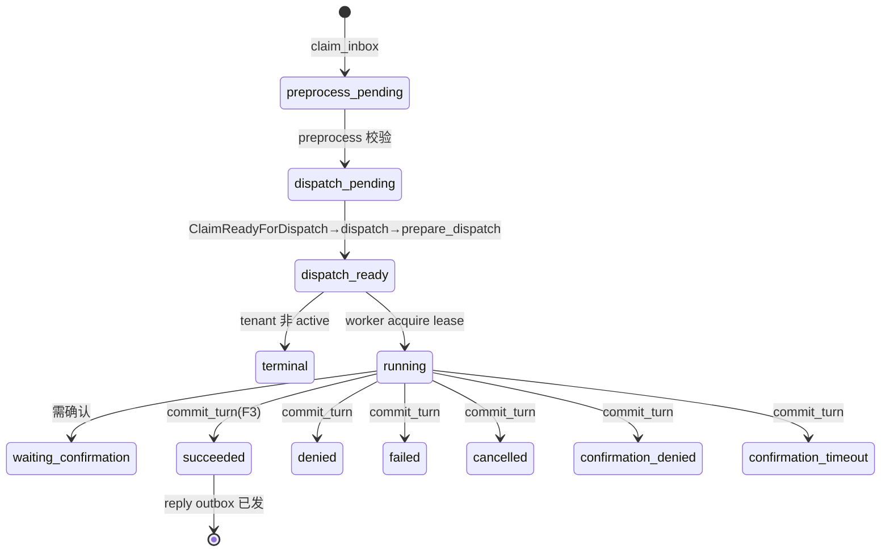
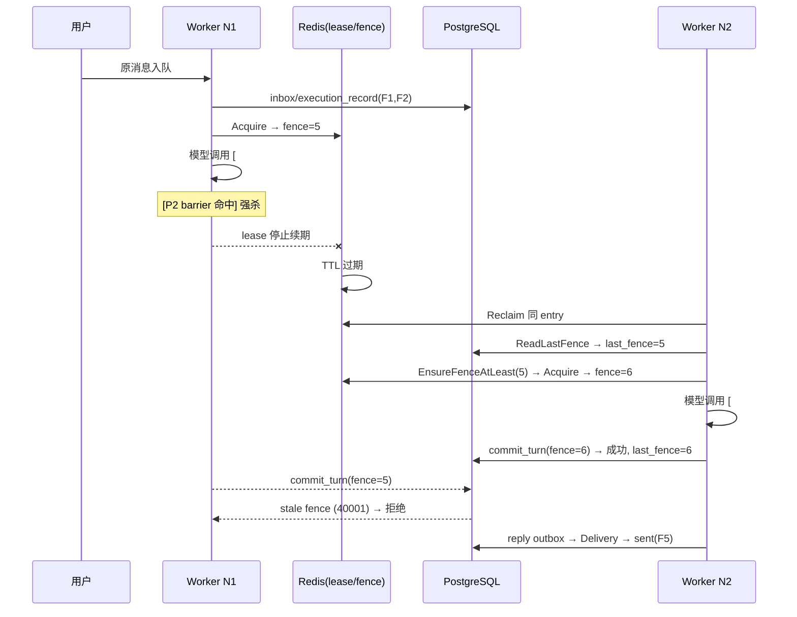
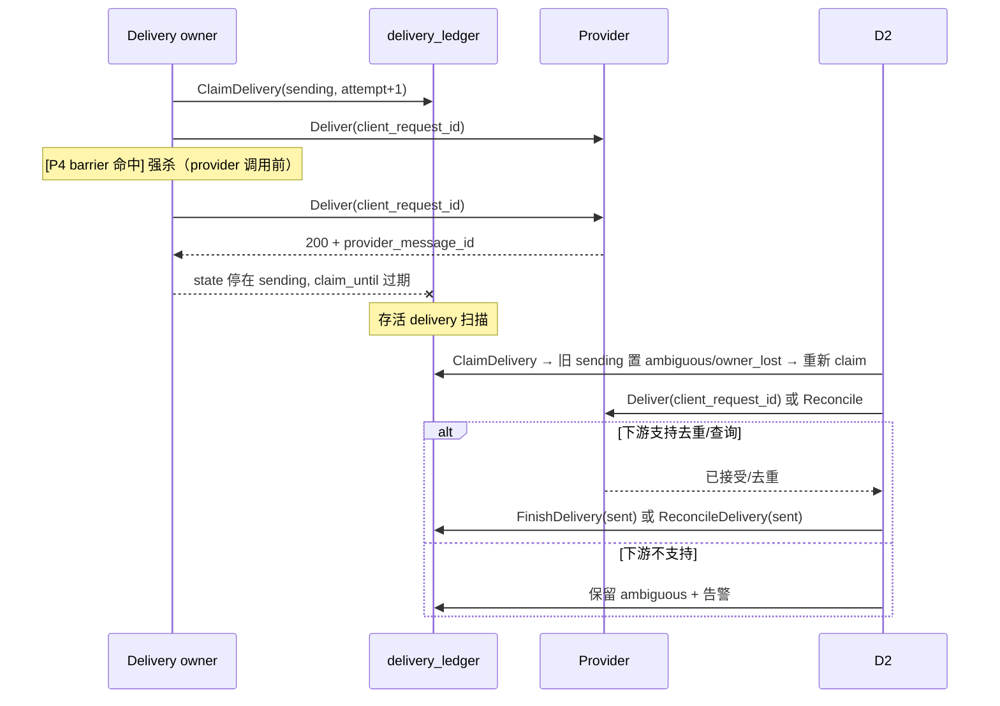

# 在途任务接管与幂等投递 — 设计文档

> 本文给出本能力的结构与时序。自足复现材料（DDL / Redis Lua / CAS SQL）见 [REFERENCE-IMPLEMENTATION.md](./REFERENCE-IMPLEMENTATION.md)。

---

## 一、总体架构

```text
                WeCom / 平台 callback
                        │
                        ▼
   ┌──────────────────────────────────────────────────────────┐
   │  ingress (route→binding→verify) → claim_inbox (F1)         │
   │       │ durable inbox + inbound_payload                     │
   │       ▼                                                    │
   │  preprocess worker: ClaimJobs → preprocess →               │
   │       ClaimReadyForDispatch → dispatch() ──[P1]──▶ Dispatch│
   └──────────────────────────────────────────────────────────┘
                        │  execution_record (F2, queued)
                        ▼
   ┌──────────────────────────────────────────────────────────┐
   │  worker consumer: Consume/Reclaim → acquire lease(fence)    │
   │       │ ExecuteWithLease → model/tool → renderOutbound      │
   │       └──[P2]──▶ PutResult + beforeCommit + commit_turn(F3) │
   │                  (session_commit/session_head/reply outbox   │
   │                   + reply outbox 单事务)                     │
   └──────────────────────────────────────────────────────────┘
                        │  outbox (kind='reply', pending)
                        ▼
   ┌──────────────────────────────────────────────────────────┐
   │  relay: scan unpublished reply outbox → account queue       │
   │  delivery consumer: Deliver() → 分片                        │
   │       └── ClaimDelivery [P3] ──▶ adapter.Deliver ──[P4]──▶  │
   │           FinishDelivery(sent)  (F4→F5)                     │
   │           失败/未知 → retry_wait / ambiguous / reconcile     │
   └──────────────────────────────────────────────────────────┘
```

权威存储边界：

| 边界 | 权威存储 | 恢复方式 |
|---|---|---|
| 输入接收 | PostgreSQL `inbox` | provider 重试或 Outbox relay 重放 |
| 任务 transport | Redis Stream pending | consumer group reclaim |
| 执行权 | Redis lease + PostgreSQL `session_head.last_fence` | TTL 后新 owner acquire，数据库拒绝旧 fence |
| terminal result | PostgreSQL session/result/reply outbox | 不重跑已提交的 execution |
| 下游投递 | PostgreSQL `delivery_ledger` + reply stream | claim TTL/retry/reconcile |

---

## 二、消息生命周期状态机

### 2.1 主链路状态



### 2.2 Inbox 状态（`inbox.state` CHECK）

```text
preprocess_pending ──▶ dispatch_pending ──▶ dispatch_ready ──▶ terminal
```

`terminal` 行携带 `terminal_reason`（tenant 非 active 时的 tenant status，或 dispatch 拒绝原因）。`prepare_dispatch` 对 `dispatch_ready` 直接返回既有 `input_seq` + `accepted=true`；对 `terminal` 返回 `accepted=false` + `terminal_reason`。

### 2.3 Execution 状态（`execution_record.outcome` CHECK）

```text
queued → running → pending → (succeeded|denied|failed|cancelled|confirmation_denied|confirmation_timeout)
                 ↘ blocked (park 用尽/超时)
```

`pending` 是 `park_execution` 把尚未轮到的输入「停放」的状态（见 §四）。终态集合在 SQL 中字面为：
`('succeeded','denied','failed','cancelled','confirmation_denied','confirmation_timeout')`。

### 2.4 Delivery Ledger 状态（`delivery_ledger.state` CHECK）

```text
pending ──▶ sending ──▶ sent
   │            │
   │            └──▶ ambiguous ──▶ (reconcile) ──▶ sent | retry_wait
   └──▶ retry_wait ──▶ (not_before 到期) ──▶ sending
                    ambiguous ──▶ failed (reconcile_exhausted)
```

`CHECK` 约束：`state='sending'` 时 `claim_owner/claim_until` 必须非空；非 sending 时必须为空。这是「不会双发」的数据库层保证（不变量 I6）。

---

## 三、四个故障窗口的数据边界

每个窗口的「已持久化 / 未持久化」分界线，决定正确恢复动作：

| 窗口 | 已落库（存活节点可见） | 未落库（随进程死亡丢失） | 接管动作 |
|---|---|---|---|
| P1 | `inbox`(F1) + `preprocess_job`(ready) | 尚未创建 `execution_record` | 扫描 ready job 继续 dispatch |
| P2 | `execution_record`(running) + lease(redis) + Redis stream pending | 模型中间态、render 结果、result_payload | reclaim + 新 fence 重跑，只一个 terminal commit |
| P3 | `session_commit`(终态) + `session_head` 推进 + reply outbox(claimed) + `result_payload` | reply event 尚未发布，adapter 尚未调用 | relay 重领 outbox 并发布同一 event |
| P4 | `delivery_ledger`(sending) + 稳定 `client_request_id` | provider 尚未调用 | claim 接管后安全调用；调用后未知结果才走下游去重/对账 |

> 关键洞察：P1/P2 的「半成品」在 PostgreSQL，进程死亡后存活节点能发现；P3/P4 的「半成品」在 ledger/outbox，同样可发现。所有窗口都不依赖进程内存状态——这正是本设计能接管的前提。

---

## 四、任务租约与执行权回收设计

### 4.1 三个数字

- **lease（Redis）**：`trpc:{env}:{tag}:lease`，value = `workerID|leaseID|fence`，TTL 由 `LeaseTTL` 控制（`webui-local` 装配值 30s；组件兜底默认仅在其 ≤0 时退化为 5s）。
- **fence（Redis 计数器）**：`trpc:{env}:{tag}:fence`，`Acquire` 时 `INCR`，单调递增。
- **last_fence（PostgreSQL）**：`session_head.last_fence`，每次 `commit_turn` 用 `GREATEST(last_fence, fence)` 推进。

### 4.2 为什么需要三道防线

```text
renew 失败 ──▶ markLeaseLost() ──▶ cancelExecution ──▶ 不 ACK
lease 过期 ──▶ N2 acquire higher fence ──▶ 重试/续处理
N1 迟到 commit ──▶ commit_turn 校验 p_fence < last_fence ──▶ stale fence ──▶ no state change
```

1. **Redis lease TTL**：进程存活时靠续租（间隔 `RenewInterval = LeaseTTL/3`）保活；进程被 SIGKILL 后 TTL 自然过期，锁自动释放。
2. **Redis fence 单调**：保证后 acquire 的 owner 一定拿到更大 fence。
3. **PostgreSQL last_fence**：最终防线。即使 Redis 重启导致 fence 计数归零，`EnsureFenceAtLeast(key, persistedFence)` 会用持久化 `last_fence` 校准，避免 fence 倒退让旧 owner 翻案。

### 4.3 acquire / renew / release 语义（Redis Lua）

```lua
-- acquire: 仅当 lease 不存在才成功，并 INCR fence
if redis.call('EXISTS', KEYS[1]) == 1 then return {0, '0'} end
redis.call('INCR', KEYS[2])
local fence = redis.call('GET', KEYS[2])
redis.call('PSETEX', KEYS[1], ARGV[3], ARGV[1]..'|'..ARGV[2]..'|'..fence)
return {1, fence}

-- renew: 整体值串比对，匹配才续期
if redis.call('GET', KEYS[1]) ~= ARGV[1] then return 0 end
redis.call('PEXPIRE', KEYS[1], ARGV[2]); return 1

-- release: 整体值串比对，匹配才删除
if redis.call('GET', KEYS[1]) ~= ARGV[1] then return 0 end
return redis.call('DEL', KEYS[1])
```

`acquire` 冲突返回 `runtime.ErrVersionConflict`；fence 解析失败/为 0 → `ErrInvariantViolation`。`workerID` 不得为空、不得含 `|`。

### 4.4 park_execution：尚未轮到的输入

`park_execution(p_tenant_id, p_request_id, p_input_seq, p_base_delay_seconds, p_max_delay_seconds, p_deadline_seconds, p_max_attempts)` 处理 `ErrInputNotReady`：当 `p_input_seq < next_input_seq` 时，必须存在对应终态 `session_commit` 才返回 `terminal`（否则 `XX001`）；当 `p_input_seq = next_input_seq` 返回 `ready`；否则按指数退避停放（`pending` + `not_before`），用尽 `p_max_attempts`(≤64) 或超 `deadline` 转 `blocked`。这把「输入序号尚未轮到」安全停放，不丢任务、不误提交。

---

## 五、Outbox / Ledger 设计

### 5.1 Transactional Outbox（F3↔F4 解耦）

`commit_turn` 在单事务写入 `session_commit` + `session_head` + `outbox`（`kind='reply'`，`idempotency_key = format('%s:%s', kind, idempotency_key)`）。**注意**：`p_events` 在生产 durable turn 中为 null（`BufferedTurn.Commit` 置 nil），会话转写由官方会话后端 `session_events` 持有，故不要从平台 `session_event` 找历史（见本包 [REFERENCE-IMPLEMENTATION.md](REFERENCE-IMPLEMENTATION.md) 的会话与 DDL 章节）。outbox 行带 `ON CONFLICT ON CONSTRAINT outbox_tenant_id_kind_idempotency_key_key DO NOTHING`，保证 replay 收敛不报错。

relay 至少一次发布：`ClaimOutbox(kind,state='pending') → 发布 → MarkPublished`。发布失败则 `MarkRetry`（回到 `retry_wait` + `next_attempt_at`），由扫描补发。

### 5.2 Delivery Ledger（F4↔F5 防双发）

`ClaimDelivery` 的核心 CAS 逻辑（逐字语义，见 [REFERENCE-IMPLEMENTATION.md](./REFERENCE-IMPLEMENTATION.md) §Ledger CAS）：

1. 先把 `state='sending' AND claim_until<=now()` 的旧 claim 置 `ambiguous`/`owner_lost`（回收超时 owner）；
2. `INSERT ... ON CONFLICT (tenant_id,delivery_key,segment_no) DO UPDATE SET state='sending', attempt=attempt+1 ... WHERE state IN ('pending','retry_wait') AND not_before<=now() AND renderer_version/format_version/content_digest/segment_count/client_request_id 全部匹配`；
3. 无行返回 → `GetDelivery`；若 `Plan != plan` → `ErrIdempotencyCollision`。

`FinishDelivery` 只允许从 `state='sending' AND claim_owner=$owner AND client_request_id=$id` 转换到目标态，成功即清空 owner/claim_until。`RenewDeliveryClaim` 用 `version=$4 AND state='sending' AND claim_owner=$5 AND client_request_id=$6 AND claim_until>now()` 三重条件，失败即 `ErrVersionConflict`（不变量 I6）。

### 5.3 三计数如何落到表

| 计数 | 字段 | 递增时机 |
|---|---|---|
| 模型调用次数 | （不落库） | 每次 `ExecuteWithLease` 重跑模型 |
| 任务尝试次数 | `execution_record.park_attempt` | `park_execution` 每次 `attempt = park_attempt+1` |
| 任务尝试次数 | `delivery_ledger.attempt` | `ClaimDelivery` 冲突更新 `attempt=attempt+1` |
| 最终回复次数 | `delivery_ledger` 每 segment 一行 | `state='sent'` 后不可重发，只 ACK |

---

## 六、时序图

### 6.1 P2 接管（最典型）



### 6.2 P4 不确定投递



> 因果链：P4 之所以不能「凭超时判失败重发」，是因为下游可能已经接受；`client_request_id` 去重 + `reconcile` 才是收敛依据，否则只能诚实 `ambiguous`。

---

## 七、为什么不能只做 X（设计取舍汇总）

- **只做接收去重（Inbox）→ 不够**：P2/P3/P4 仍需 lease/fence/ledger 三层保证。
- **只做 lease 不加 fence 校验 → 不够**：Redis 重启或时钟问题会让旧 owner 翻案，`commit_turn` 的 `p_fence < last_fence` 是最终防线。
- **P3 重跑模型 → 错误**：F3 已是终态，重跑违反「一次 terminal commit」且破坏工具副作用幂等。
- **ACK 早于 terminal commit → 错误**：丢失在途任务（不变量 I5）。
- **一个幂等键覆盖全阶段 → 错误**：三个事实落在不同存储/生命周期，必须分层（见 FULL-GUIDE §8）。
- **P4 承诺 exactly-once → 错误**：只有下游支持 `client_request_id` 去重/查询才收敛，否则诚实 `ambiguous`。

---

## 八、数据边界详细字段表

每个窗口的「已落库 / 未落库」分界线由下列字段标识，恢复函数据此决策：

| 窗口 | 关键字段 | 判定式（恢复者应见） |
|---|---|---|
| P1 | `preprocess_job.state`, `dispatched_at` | `state='ready' AND dispatched_at IS NULL` → 可继续 dispatch |
| P2 | `execution_record.outcome`, Redis `lease`, `session_head.last_fence` | `outcome IN ('running','pending')` 且 lease 过期 → reclaim + 新 fence |
| P3 | `session_commit.outcome`, `outbox.state`, `result_payload` | 终态 session_commit + `outbox.state='pending'` → 重放发送 |
| P4 | `delivery_ledger.state`, `claim_until`, `client_request_id` | `sending` 且 `claim_until<=now()` → 接管并从 provider 调用前继续；真实调用结果未知才转 `ambiguous` |

> 注意：`preprocess_job` 的 `prepared_payload_ref` 与 `channel_binding_id` 必须随 job 持久化，否则转入异步链路后 tenant 归属与 payload 会丢失。

## 九、reclaim 与续租时序

worker `consumer.go` 的 `Run()` 内部：

```text
Run():
  ├─ 启动 reclaim goroutine：每 ReclaimInterval(装配值 5s) Broker.Reclaim(consumerID, limit=100)
  │     └─ 对每条走 process → handle（ErrCommitConflict/ErrVersionConflict 按 RetryWait 重试）
  └─ Consume 回调：执行失败【故意返回 nil】以免 worker 退出，让空闲 delivery 可被 reclaim
```

`handle()` 续租细节：

```text
acquire lease → defer Release(1s ctx)
启动续租 goroutine：每 RenewInterval(=LeaseTTL/3) Renew；失败 → markLeaseLost() + cancelExecution
beforeCommit：先查 leaseLost → Renew 一次；失败 → ErrLeaseLost
执行 ExecuteWithLease；ErrInputNotReady → Parker.ParkInput（Ready 重试 / Terminal 视为成功 / Blocked 上报）
executeErr != nil → 直接 return（不 ACK）
否则 Broker.Ack
```

关键：续租失败的 `markLeaseLost` 用 `sync.Once` 关闭 `leaseLost` channel 并取消执行 context；`beforeCommit` 是提交前最后一道闸，数据库 fence 是最终防线。

## 十、对账数据流（ambiguous → 收敛）

```text
delivery_ledger.state='ambiguous'
   │ 存活 delivery 定时扫描 delivery_ledger_retry_idx (state IN pending/retry_wait/ambiguous)
   ▼
reconcile(): NotBefore 未到 → Deferred
   │ adapter 未实现 DeliveryReconciler → deferReconciliation（cap=MaxReconcileAttempts=8）
   ▼
ReconciliationDelivered → ReconcileDelivery(sent)   [下游确认已接受]
ReconciliationNotDelivered → retry_wait + 'reconciled_not_delivered'
ReconciliationUnknown → 继续 defer
超过 MaxReconcileAttempts → finishFailed(..., 'reconcile_exhausted', reconcile=true)
```

`FindReconciliationIssues(before, limit)` 还会返回 `stuck_inbox`/`expired_outbox_claim`/`parked_input`/`missing_reply_outbox`/`stuck_delivery`/`ambiguous_delivery`，供值班定期扫描（见 [release-and-operations.md](./release-and-operations.md) 对账手册）。

---

## 十一、窗口与存储的对应关系（一句话速查）

| 窗口 | 主存储 | 关键状态 | 恢复者 | 禁止动作 |
|---|---|---|---|---|
| P1 | PostgreSQL `inbox` + `preprocess_job` | `preprocess_pending`/`dispatch_pending`/`ready` | preprocess worker | 手工重新入队 |
| P2 | PostgreSQL `execution_record` + Redis lease | `running`/`pending` + fence | worker reclaim | 删 lease / 早 ACK |
| P3 | PostgreSQL `session_commit` + `outbox` | 终态 + `pending` reply | relay + delivery | 重跑模型 |
| P4 | PostgreSQL `delivery_ledger` | `sending`/`ambiguous` | delivery + reconcile | 盲重发 / 伪造 receipt |

## 当前实现增量：工具执行状态机

`tool_execution` 是 P2 内部的第二层状态机：`pending -> running -> succeeded|failed|effect_unknown`。Claim 只能创建记录，或接管 lease 已过期的 `running` 记录；每次接管增加 `attempt` 与 `fence`。`Renew`/`Finish` 必须同时匹配 `lease_owner+fence`，避免旧节点完成迟到副作用。详细字段与 SQL 见 `REFERENCE-IMPLEMENTATION.md` 的当前实现增量。
