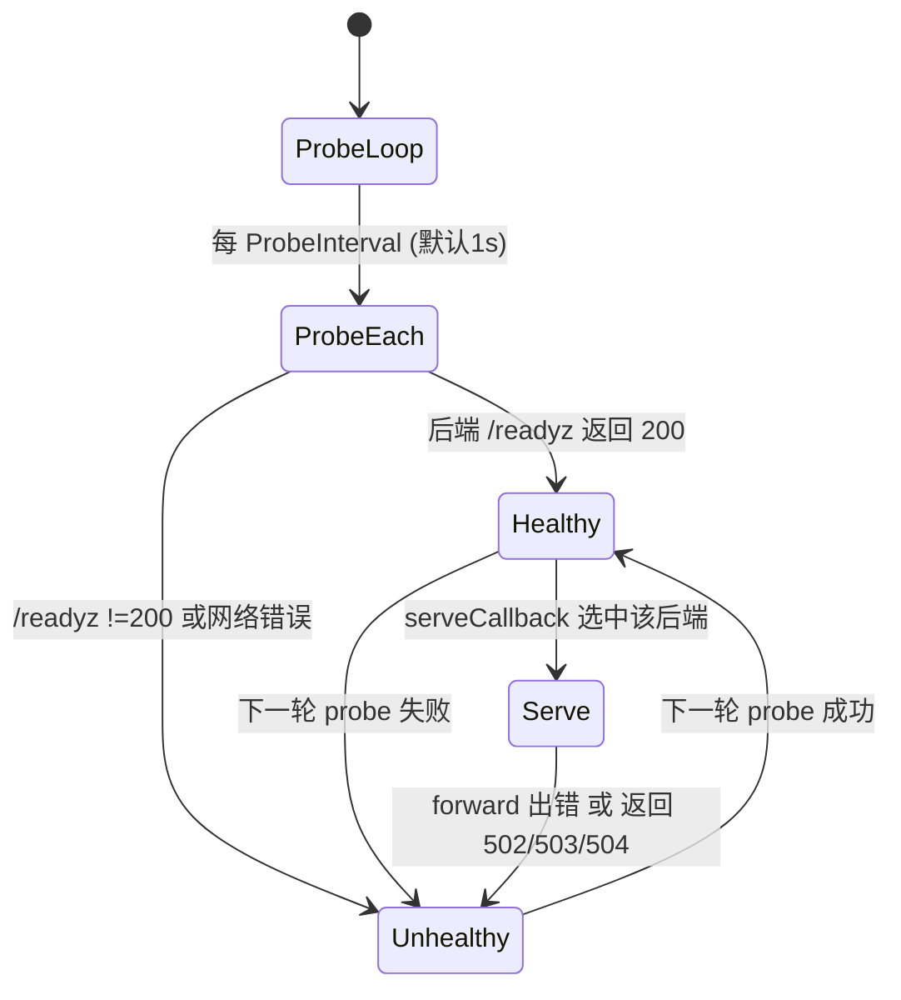
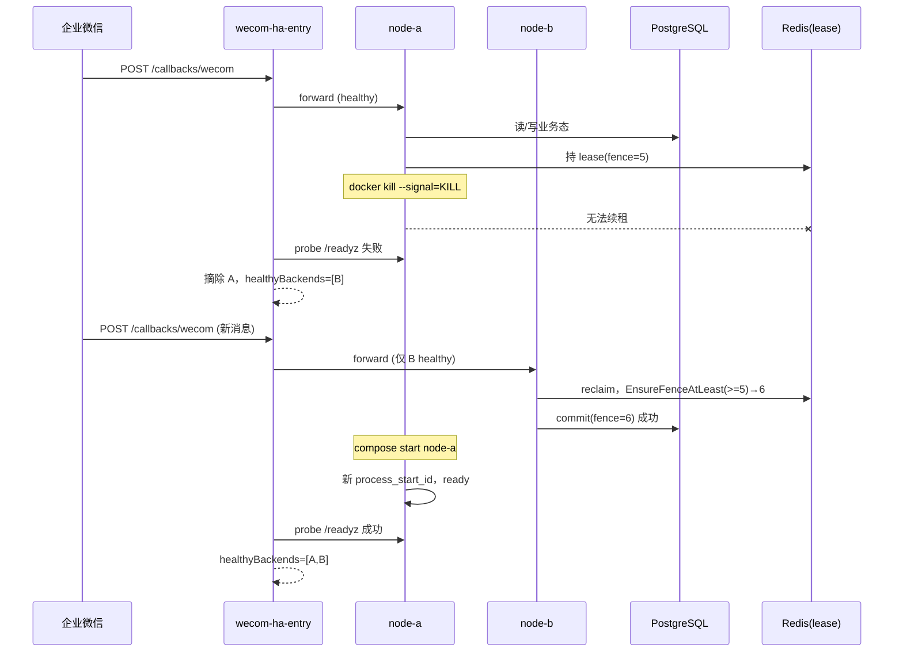

# 单主机多容器实例可用性 — 设计文档

> 本文给出拓扑、角色、状态机、时序、身份模型与编排设计。所有服务名、端口、环境变量与 HTTP 路径均来自对应源文件（可选核对：`deploy/compose/docker-compose.local.yml`、`cmd/trpc-service/wecom_ha_entry_role.go`、`cmd/trpc-service/webui_local_role.go`）。

## 一、拓扑

```text
                          Host H1 (单一故障域)
 ┌──────────────────────────────────────────────────────────────────────┐
 │  wecom-ha-entry  :8080  (宿主 58087)                                  │
 │     │ 唯一允许暴露给 HTTPS tunnel / 企业微信控制台的端口                │
 │     │ 每秒 probe 两后端 /readyz，只转发 healthy 后端                   │
 │     ├──► wecom-ha-node-a  :8080  (宿主 58088)                         │
 │     └──► wecom-ha-node-b  :8080  (宿主 58089)                         │
 │            │  两实例均为 wecom-local，TRPC_WEBUI_LOCAL_INSTANCE_ID 不同 │
 │            │  共享权威态与队列                                          │
 │            ▼                                                          │
 │  postgres (durable state)  redis (stream/lease)  qdrant  clamav  otel │
 └──────────────────────────────────────────────────────────────────────┘
        wecom-ha-bootstrap (一次性 webui-local-bootstrap, 不常驻)
```

入口独立于 app 节点；否则强杀入口所在应用只能验证内部 Worker，不证明真实 WeCom 输入还能到达服务。**node-a / node-b 的宿主机端口默认 `58088` / `58089` 仅供本地观测，不得登记为企业微信回调地址**；对外只暴露入口 `58087`。

## 二、模块 1：实例身份与资源隔离

| 配置 | N1 | N2 | 目的 |
|---|---|---|---|
| `TRPC_WEBUI_LOCAL_INSTANCE_ID` | `wecom-ha-node-a` | `wecom-ha-node-b` | 部署槽位；lease/日志/metrics 区分 |
| 进程启动身份 `process_start_id` | 启动时随机 8 字节 hex（16 字符） | 启动时重新生成 | 区分进程 incarnation，防止"旧 owner 复活" |
| owner 命名 | `webui-local-<component>-wecom-ha-node-a-<psid>` | `webui-local-<component>-wecom-ha-node-b-<psid>` | 写入 lease / ledger claim / 日志 / consumer group |
| 宿主机观测端口 | `58088` | `58089` | 仅观测，容器内固定 `:8080` |
| 入口端口 | `58087`（唯一对外） | — | 仅此端口可登记为企业微信回调 |

业务状态必须写 PostgreSQL；Redis 保存可重放 transport 与 coordination（lease/fence）。两实例通过 Kubernetes/Compose 各自的容器文件系统天然隔离本地暂态；共享卷仅 `webui-local-skills:/var/lib/trpc-webui-local/skills` 这类只读/并发安全的资源，**不能**保存 session、lease 或待发回复——这些必须在 PostgreSQL/Redis 中共享。

> 校正：早期草稿把节点端口写成 `58083`/`58084`，那属于 `webui-multinode` profile（非本包）。本包 `wecom-ha-local` 的节点端口是 `58088`/`58089`，入口是 `58087`。

## 三、模块 2：健康检查与统一入口（状态机）

入口维护 `weComHAEntryBackend{ URL, healthy atomic.Bool }`，`healthyBackends()` 从原子轮转下标 `next` 开始按序返回健康后端（round-robin 起点）。



`/readyz`（入口自身）：仅当 `len(healthyBackends())==0` 时 503，否则 200。
`/livez`（入口自身）：恒 200。

应用节点侧：

```text
SIGTERM  → preStop → readiness 置 false → drain(≤30s) → exit (优雅)
SIGKILL  → 无 drain → 入口 probe 摘除该后端 → peers reclaim 过期 lease/claim 后接管
```

## 四、模块 3：健康探测时序

```text
时间 ──────────────────────────────────────────────────────────►
entry:
  |--probe--|--probe--|--probe(KILL命中)--|--probe--|
            │         │                    │
node-a:     │ ready   │ ready             │ ✗ /readyz 失败 (已 SIGKILL)
node-b:     │ ready   │ ready             │ ready (继续服务)
            │         │                    │
对外:       callback 经 entry → 选 healthy → 故障后只剩 node-b
```

探测实现：对每个 backend 请求 `<backend>/readyz`；HTTP 200 → `healthy.Store(true)`，否则 `healthy.Store(false)`。健康状态以原子布尔保存，转发与 `/statusz` 可并发读取。`forward` 中出现连接错误、502、503 或 504 时，入口会把同一 callback 尝试另一个健康后端；业务幂等仍由 durable ingress 的 provider-message identity 保证。

## 五、模块 4：多实例工作竞争

- **Work Stream**：同一 group，不同 consumer ID（含 `process_start_id`）；idle pending 由其他实例 reclaim。
- **Session**：以 `(tenant, app, session)` Redis lease 串行；PostgreSQL fence 拒绝旧 owner commit（`commit_turn` 的 `p_fence < last_fence` → `stale fence`）。
- **Reply Stream**：按 destination 消费；Delivery Ledger Claim（`claim_owner`/`claim_until` + version 条件更新）防止两个实例重复发送同一 reply segment。
- **Outbox**：两个 relay 都可扫描和幂等发布；`ON CONFLICT ON CONSTRAINT outbox_tenant_id_kind_idempotency_key_key DO NOTHING` 保证不重复发布。

## 六、模块 5：实例身份模型

```text
Deploy Slot (固定)                Process Start ID (每次启动新)
TRPC_WEBUI_LOCAL_INSTANCE_ID  +   newWebUILocalProcessStartID() (8B rand → 16 hex)
        │                                      │
        └──────────────┬───────────────────────┘
                       ▼
        webui-local-<component>-<slot>-<psid>
        例: webui-local-worker-wecom-ha-node-a-9f3c1a2b4d5e6f07
                       │
        ┌──────────────┼───────────────────────────────────────┐
        ▼              ▼                                        ▼
   lease owner    ledger claim_owner                   redis consumer id
   (Redis)        (PostgreSQL delivery_ledger)         (stream consumer group)
```

Worker、preprocess、relay、delivery 的内部 owner 名都含 `instance_id` 与 `process_start_id`。`/statusz` 仅公开实例身份和启动身份；重新加入时 `process_start_id` 改变，内部 owner 名随之改变——旧 lease 在 TTL 后过期，旧 consumer 的 pending 被新进程（或 peer）reclaim。

## 七、模块 6：端口的网络语义

| 端口（宿主） | 服务 | 网络语义 | 是否可登记为企业微信回调 |
|---|---|---|---|
| `58087` | `wecom-ha-entry` | **唯一对外**：HTTPS tunnel / 企业微信控制台指向此处 | ✅ 是（唯一） |
| `58088` | `wecom-ha-node-a` | 仅本地观测（`/statusz`/`/readyz` 调试） | ❌ 否 |
| `58089` | `wecom-ha-node-b` | 仅本地观测 | ❌ 否 |

两个 Bot 回调共用 `58087` 同一 public origin，只用 durable route key（`local-wecom` / `local-wecom-secondary`）区分，不依赖不同端口。

## 八、模块 7：Compose 编排设计

关键服务（profile `wecom-ha-local`）：

- `wecom-ha-bootstrap`：`command: webui-local-bootstrap`，一次性初始化共享 tenant/config，`TRPC_WEBUI_LOCAL_INSTANCE_ID=wecom-ha-bootstrap`，依赖 postgres/redis/qdrant healthy。
- `wecom-ha-node-a` / `wecom-ha-node-b`：`command: wecom-local`，`restart: "no"`，共享 `TRPC_POSTGRES_DSN` / `TRPC_REDIS_ADDRESS: redis:6379` / `TRPC_WEBUI_LOCAL_CLAMAV_ADDRESS: clamav:3310`；主/次 Bot 均启用；`INSTANCE_ID` 分别为 `wecom-ha-node-a` / `wecom-ha-node-b`；端口 `${TRPC_LOCAL_WECOM_HA_NODE_A_PORT:-58088}:8080` / `${TRPC_LOCAL_WECOM_HA_NODE_B_PORT:-58089}:8080`；`depends_on: wecom-ha-bootstrap(service_completed_successfully)`、clamav、otel-collector。此 profile 不透传 in-flight barrier；P1–P4 只由独立 `webui-multinode` 测试 profile 启用。
- `wecom-ha-entry`：`command: wecom-ha-entry`，`restart: "no"`；`TRPC_WECOM_HA_ENTRY_BACKENDS: http://wecom-ha-node-a:8080,http://wecom-ha-node-b:8080`；`TRPC_WECOM_HA_ENTRY_PROBE_INTERVAL: 1s`；端口 `${TRPC_LOCAL_WECOM_HA_ENTRY_PORT:-58087}:8080`。注释明确：**这是唯一允许暴露给 HTTPS tunnel / 企业微信控制台的端口**。
- PostgreSQL / Redis / Qdrant / ClamAV / otel-collector 为共享依赖（同故障域）。

完整可直接照抄的 Compose 片段见 `REFERENCE-IMPLEMENTATION.md` 第 3 节。

## 九、模块 8：隔离与共享边界表

| 维度 | 隔离（每实例独立） | 共享（同一故障域/权威） |
|---|---|---|
| 部署身份 | `TRPC_WEBUI_LOCAL_INSTANCE_ID`、`process_start_id`、owner/consumer 名 | — |
| 观测端口 | `58088` / `58089`（宿主） | — |
| 进程内暂态 | 各自进程内存：inflight barrier controller、连接池、模型客户端、取消监听 goroutine | — |
| 容器内临时目录 | 各容器自己的 `/tmp` 等可写层 | — |
| 技能暂存根 | — | `webui-local-skills` 命名卷（`/var/lib/trpc-webui-local/skills`）——**可写，但写入方式是并发收敛的**，见 §9.2 |
| 权威业务态 | — | PostgreSQL（`inbox`/`session_*`/`execution_record`/`outbox`/`delivery_ledger`…） |
| 队列与协调 | — | Redis（Work/Reply/Wakeup Stream、lease、fence） |
| 向量/媒体/遥测 | — | Qdrant、ClamAV、otel-collector |
| 故障域 | — | 宿主机、Docker daemon、共享磁盘、PostgreSQL、Redis |

### 9.1 "本地状态"到底有哪些（逐项交代）

需求中的"本地状态隔离"容易被写成一句空话。本系统的本地状态只有三类，逐项如下：

| 本地状态 | 位置 | 两实例之间 | 冲突风险 | 消除机制 |
|---|---|---|---|---|
| 进程内控制器与运行态 | 进程内存 | **天然隔离** | 无 | 容器/进程各自独立；`inflight` barrier controller 是 process-local，不共享 |
| 容器可写层与临时目录 | 容器文件系统 | **天然隔离** | 无 | Docker 各自容器层；镜像只读层不被写入 |
| 技能暂存根（落盘） | 命名卷 `webui-local-skills` | **共享**（两实例挂同一卷） | 两实例可能对同一租户、同一技能版本并发暂存 | §9.2 —— 内容寻址路径 + 临时目录原子改名 + 幂等校验，冲突最终收敛 |
| 观测端口 / owner 名 | 宿主端口 + 命名 | 隔离（不同端口、不同 `process_start_id`） | 无 | 见 §二、§六 |

> **注意技能暂存根是唯一的"共享可写本地状态"。** 它之所以存在，是因为训练/技能资产体积大、不适合进数据库；之所以不构成实例冲突，是因为写入路径是**内容决定**的（同名即同内容），而并发写入用临时目录 + 原子改名收口。**不能把它描述成"只读资源"** —— 它是可写的，安全性来自写入协议而非只读性。

### 9.2 技能暂存为什么并发不冲突（实现依据）

暂存路径由租户、技能 ID、版本与内容摘要共同决定：

```text
<StagingRoot>/<tenantID>/skills/<skillID>/v<version>-<contentDigest 前 16 位>
```

写入协议（五步）：

1. 计算目标路径（内容寻址：**同内容必落同一路径**）；
2. 若目标目录**已存在** → 读取其中已有的技能文件，与本次内容**逐字节比对**：一致则视为幂等重放，直接返回；不一致则返回 `ErrIdempotencyCollision`（防止"同一版本名指向不同内容"被静默接受）；
3. 若不存在 → 在**同父目录**下创建临时目录 `.skill-stage-*`，把内容写进去并计算目录摘要；
4. `os.Rename(临时目录, 目标目录)` —— 同一文件系统内的原子改名，**不会出现"半写状态"被读到**；
5. 发布前对目录**重新计算摘要**（`Ingestor` 在 stage 后、publish 前 rehash），避免"可变路径被按引用发布"。

**诚实边界（必须写清）：** 若两个实例在同一瞬间都通过了"目标不存在"检查，则两者都会尝试改名，其中一个成功、另一个的改名会因目标已存在而失败并返回错误。这不是数据损坏，而是**需要重试的竞态**：重试时会走第 2 步（目录已存在 → 内容比对一致 → 幂等返回）从而收敛。因此本系统对该路径的承诺是**"并发写入最终收敛"**，而不是"无锁并发安全"。运维上若看到该路径的幂等冲突错误，应先在两个实例间重试，而不是手工删目录。

> 相关实现（可选核对）：`trpcservice/skill/stager.go` 的 `ArtifactStager.Stage` 与 `resolvePackageRootForWrite`、`trpcservice/skill/skill.go` 的 `Resolver`、`cmd/trpc-service/webui_local_role.go` 中对 `SkillStagingRoot` 的 `MkdirAll`/`Chmod`。

## 十、故障切换时序（mermaid sequence）



## 十一、失败窗口时间预算（默认参数）

| 阶段 | 上界 | 依据 |
|---|---|---|
| 入口探测到 N1 失败 | `ProbeInterval`(1s) + probe 超时(3s) | `probe()` |
| N1 lease 过期 | `LeaseTTL`(30s) | worker `LeaseTTL` |
| N2 reclaim 扫描 | `ReclaimInterval`(5s) | worker/relay |
| delivery claim 过期 | `ClaimTTL`(30s) | delivery |
| 主动 drain | `DrainTimeout`(30s) | worker |

> 结论必须记录采样间隔 `DELTA_POLL`，不得宣称比采样更精确的 RTO。

## 十二、消息流与控制流

```text
控制面（存活判定，轻量）:
  entry ──probe(/readyz)──► node-a / node-b       每 1s
  operator ──/statusz──► entry / node(-a/-b)      排障与演练断言

数据面（业务，重）:
  企业微信 ──/callbacks/wecom──► entry ──forward──► 健康 node
  健康 node ──Work/Reply/Wakeup Stream──► Redis
  健康 node ──session/execution/outbox/ledger──► PostgreSQL
  健康 node ──delivery──► 企业微信(回复)
```

关键不变量：

- 控制面失败（probe 失败）只影响"是否转发"，不破坏已落库业务态。
- 数据面每步都落在 PostgreSQL/Redis，N1 消失后 N2 从共享态恢复，不依赖 N1 内存。

## 十三、隔离 / 共享再确认（与实现参数对齐）

| 组件参数（来自 webui_local_role） | 值 | 含义 |
|---|---|---|
| worker `LeaseTTL` / `RenewInterval` | 30s / 10s | 租约与续租节奏 |
| worker `RetryWait` / `ReclaimInterval` / `ReclaimLimit` | 250ms / 5s / 100 | 重试与回收节奏 |
| worker `Shards` | `[0,1,2,3]` | 分片消费 |
| worker `DrainTimeout` | 30s | 优雅排空 |
| delivery `ClaimTTL` / `ClaimRenewInterval` | 30s / 10s | 投递占用 |
| delivery `DefaultRetryDelay`/`MaxRetryDelay`/`MaxAttempts`/`MaxReconcileAttempts` | 1s/1m/8/8 | 重试与对账 |
| relay `PollInterval` | 100ms | 轮询间隔 |

这些参数共同决定"故障后多久能接管、积压多久能清空"，是验收时间口径的物理基础。

## 十四、设计结论 ↔ 代码证据索引

| 设计结论 | 证据位置 |
|---|---|
| 公开地址不随 N1/N2 切换 | `wecom_ha_entry_role.go` 独立入口 + `healthyBackends()` 轮转 |
| 只有可处理业务的实例接收回调 | `probe()` 只对 `/readyz` 200 标 healthy |
| 前端转发失败可换健康后端 | `serveCallback()` 遍历 healthyBackends |
| 强杀不会被自动重启掩盖 | Compose `restart: "no"` |
| 重新加入不是旧 owner 复活 | `process_start_id` 比较（`single-host-multicontainer.sh`） |
| 同一会话单有效提交者 | Redis lease + `commit_turn` fence 拒绝 |

---

## 十五、入口的并发与竞态分析

入口 `weComHAEntryPool` 是一个被多 goroutine 并发访问的结构：探测 goroutine 周期写 `healthy`，HTTP handler 并发读并转发。竞态风险点与消除方式：

| 竞态 | 可能后果 | 消除机制 |
|---|---|---|
| 探测写 `healthy` 与 handler 读 `healthy` 并发 | 数据竞争 / 读到撕裂值 | `healthy` 为 `atomic.Bool`，读写均为原子操作 |
| 多个 callback 同时轮转起点 | 全部打到同一后端（热点） | `next` 为 `atomic.Uint64`，`Add(1)` 取模作为起点，天然错开 |
| 转发失败后重试导致重复业务调用 | 同一 callback 被两个后端各处理一次 | 🔴 只在**尚未向企业微信返回响应**时切换后端；一旦后端返回业务响应，立即 `copyResponse` 返回，不再尝试第二个后端 |
| 转发中途后端 502/503/504 | 用户侧收到错误 | 标记该后端不健康并**继续尝试下一个健康后端**；全部失败才返回 503 `no ready callback backend` |
| 请求体过大 | 内存耗尽 / 攻击面 | `http.MaxBytesReader(limit)`，超限返回 413；`limit = 2<<20`（2 MiB） |
| 慢后端拖住入口 | 入口整体不可用 | 入口 `http.Client` 设 `Timeout: 10s` 且 `CheckRedirect: ErrUseLastResponse`；服务端 `ReadHeaderTimeout=5s` / `ReadTimeout=10s` / `WriteTimeout=10s` / `IdleTimeout=60s` / `MaxHeaderBytes=16KiB` |
| 探测请求泄漏连接 | 连接数失控 | 探测后 `io.Copy(io.Discard, resp.Body)` + `Body.Close()` 显式排空并关闭 |
| 探测周期过短压垮后端 | 后端 readyz 抖动 | 配置校验限制 `TRPC_WECOM_HA_ENTRY_PROBE_INTERVAL ∈ [100ms, 1m]` |
| 重复后端地址 | 健康集合重复计数，掩盖单点 | 配置加载时对规范化后的 URL 去重，重复直接拒绝启动 |
| 后端少于 2 个 | 无接管能力却"看起来可用" | 配置加载时要求 `len(Backends) >= 2`，否则 `entry requires at least two backends` |

**核心设计判断：入口重试与业务幂等的边界。**

```text
入口负责： 把 callback 送到一个「现在能处理业务」的后端
入口不负责：tenant 路由、消息去重、会话状态、重放历史

因此：
  入口可以在「尚未返回响应」时换后端  ← 传输层重试
  入口不得在「已返回业务响应」后重发  ← 那会变成业务层重复
  重复仍由后端 durable Inbox 的 (tenant_id, channel, external_account_id, external_message_id) 归并
```

**为什么入口自身也要区分 live / ready：** 若入口进程正常但两个后端都不可用，`/livez` 仍 200 而 `/readyz` 应 503。这样监控能区分"入口进程挂了"与"没有可用的业务后端"两类完全不同的故障。

---

## 十六、健康判定矩阵

| 对象 | 判据 | 由谁判定 | 结果 |
|---|---|---|---|
| 应用节点进程 | 进程是否退出（`/livez` 恒 200） | 进程自身 | 仅表示存活，**不参与入口转发决策** |
| 应用节点业务能力 | `db.PingContext` + `redis.Ping` + malware 探针全部成功 → `/readyz` 200 | 节点自身 | 入口据此转发 callback |
| 入口后端健康 | 探测 `<backend>/readyz` 返回 HTTP 200 | 入口探测循环（默认每 1s） | `healthy=true` 才进入候选集合 |
| 入口自身业务能力 | `len(healthyBackends()) > 0` → `/readyz` 200 | 入口自身 | 监控据此判断"是否还有可用后端" |
| 入口自身进程 | `/livez` 恒 200 | 入口自身 | 与业务可用性分离 |
| 实例是否需要被接管 | 受害容器 `State.Running == false`（且平台未重建） | 外部断言（`docker inspect`） | 证明"受害实例持续停止" |
| 重新加入是否是新执行者 | `/statusz.process_start_id` 与基线不同 | 外部断言 | 证明"不是旧 owner 复活" |

**矩阵读出三个关键结论：**

1. **`/livez` 与 `/readyz` 必须分开看。** "进程活着"与"能处理业务"是两件事；把前者当后者会让"活着的死节点"继续吞 callback。
2. **入口的 health 判据是后端的 `/readyz`，不是容器状态。** 因此探测对象必须是应用自身的业务就绪接口，而非 Docker 的容器运行状态。
3. **"受害实例持续停止"与"重加入换了身份"是外部可观测事实，不由服务端自证。** 二者必须由演练脚本用 `docker inspect` 与 `/statusz` 比对来断言，否则无法归因。

---

## 十七、网络与安全边界

### 17.1 端口暴露面

| 端口 | 允许的访问者 | 是否可登记为企业微信回调 | 说明 |
|---|---|---|---|
| 入口端口（宿主 `58087`） | 外部 HTTPS tunnel / 企业微信控制台 | ✅ **唯一允许** | 两个 Bot 共用同一 public origin，靠 route key 区分 |
| node-a 观测端口（宿主 `58088`） | 仅本机运维 / 演练脚本 | ❌ **禁止** | 绕过入口的 readiness 摘除逻辑 |
| node-b 观测端口（宿主 `58089`） | 仅本机运维 / 演练脚本 | ❌ **禁止** | 同上 |
| 容器内 `:8080`（三个服务） | Compose 内部网络 | ❌ | 不直接对外 |

🔴 **把节点观测端口登记为回调地址是严重的配置错误**：它绕过了"只把 callback 交给健康节点"这一核心机制，强杀后的 callback 会打到已死节点上，演练结论失真。

### 17.2 控制面端点的安全要求

| 端点 | 要求 |
|---|---|
| `/statusz` | 输出 `instance_id`、`process_start_id`；**不返回** tenant、会话、消息内容或 Secret。组件 owner 是运行时内部身份，barrier 状态仅经受保护的 point endpoint 查询。 |
| `/livez`、`/readyz` | 无鉴权，但不得泄露内部拓扑细节（`/readyz` 只返回状态码，不返回后端列表） |
| `/test/failover/{p1|p2|p3|p4}/{arm,status,release}` | 仅当 `TRPC_WEBUI_LOCAL_FAILOVER_TEST_ENABLED=true` 时注册；每项要求正确 `X-TRPC-Local-Token`，否则 403；**绝不经公网入口暴露** |
| `/callbacks/wecom` | 只接受 GET/POST（其他 405）；请求体上限 2 MiB；验签由后端的可信入口候选流程完成（见 `conversation-continuity` 包） |

### 17.3 转发时的头部处理

`forward()` 会：路径拼接（保留原 path 与 query 串）、复制请求头、**删除** `Connection` / `Proxy-Connection` / `Transfer-Encoding`（hop-by-hop 头不应跨代理传递）、设置 `X-Forwarded-For`（来源地址）与 `X-Forwarded-Proto: http`、显式设置 `ContentLength`。

`copyResponse()` 同理：回写给客户端时跳过 `Connection` / `Transfer-Encoding`，其余头透传，随后写状态码并拷贝 body。

### 17.4 信任边界（入口不做什么）

```text
入口是「可用性组件」，不是「安全边界」：
  ✗ 不决定 tenant（tenant 只能由验签后的 binding 推出）
  ✗ 不做消息去重（由后端 durable Inbox 归并）
  ✗ 不保存会话状态（权威态在 PostgreSQL / Redis）
  ✗ 不鉴权企业微信回调（由后端按 binding 凭据验签）
  ✓ 只做：readiness 探测 + 健康后端选择 + 传输层失败时换后端
```

因此入口可以简单、可观测、可替换；而租户隔离、消息一次性与会话连续性的保证**全部落在后端**（详见 `conversation-continuity` 与 `inflight-task-takeover` 两个包）。

---

## 十八、文档索引

| 想了解 | 读 |
|---|---|
| 完整原理、退化模式、重新加入序列、结论模板 | `FULL-GUIDE.md` |
| 逐模块实现与每步 durable truth | `implementation-walkthrough.md` |
| 关键代码摘录与状态语义 | `CODE-APPENDIX.md` |
| 从零复现（入口实现 / Compose / 契约 / 清单） | `REFERENCE-IMPLEMENTATION.md` |
| 测试、负载检查、判定表 | `testing-and-acceptance.md` |
| 发布、观测、告警、回滚、处置 | `release-and-operations.md` |
